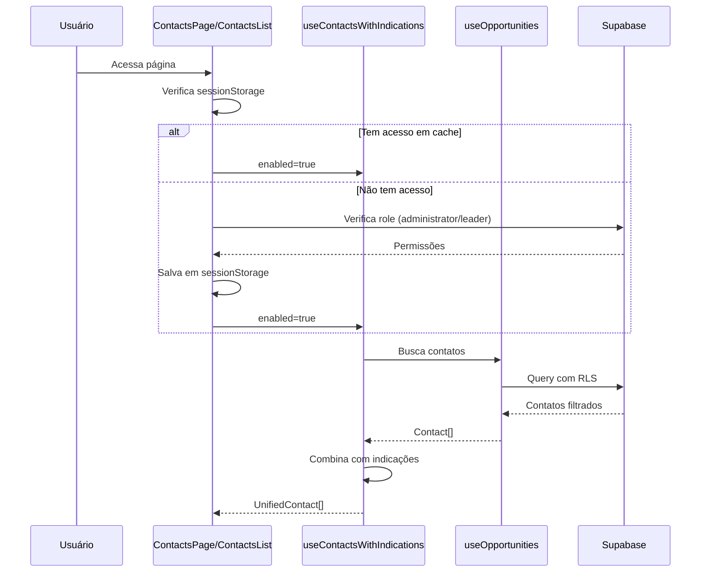
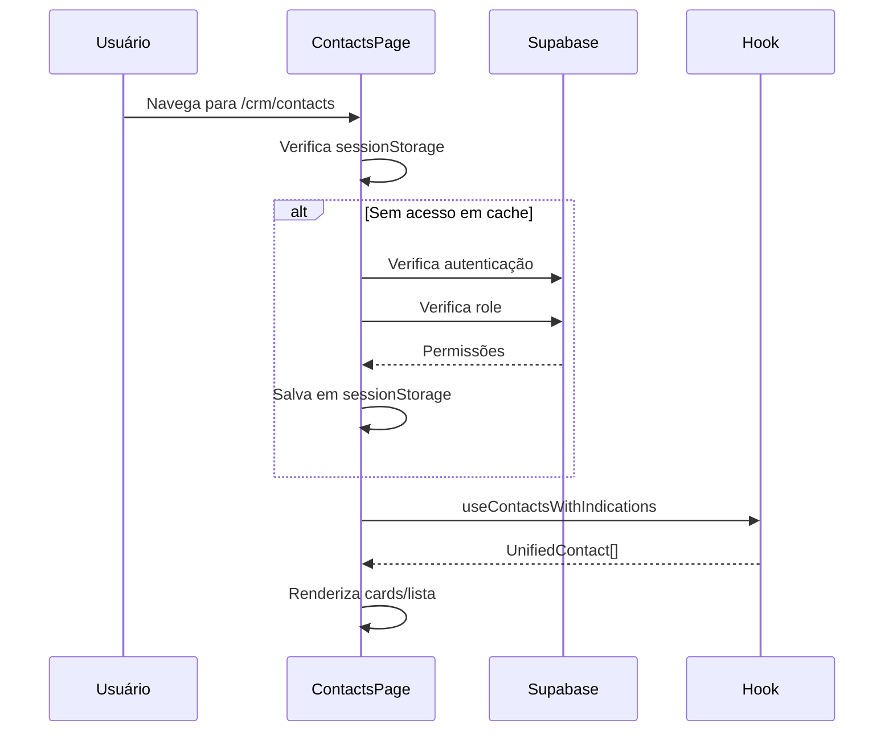
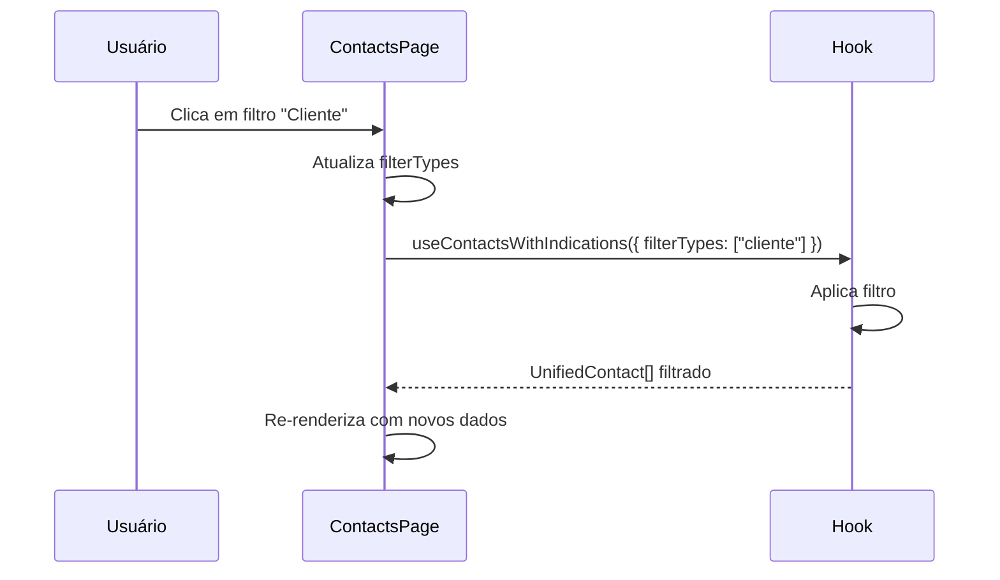
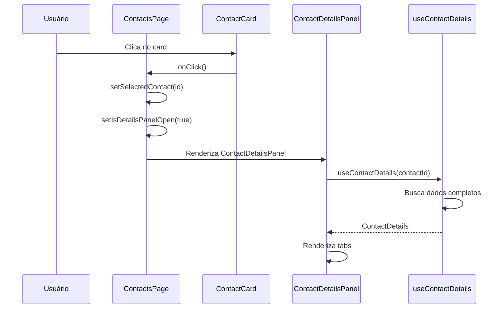
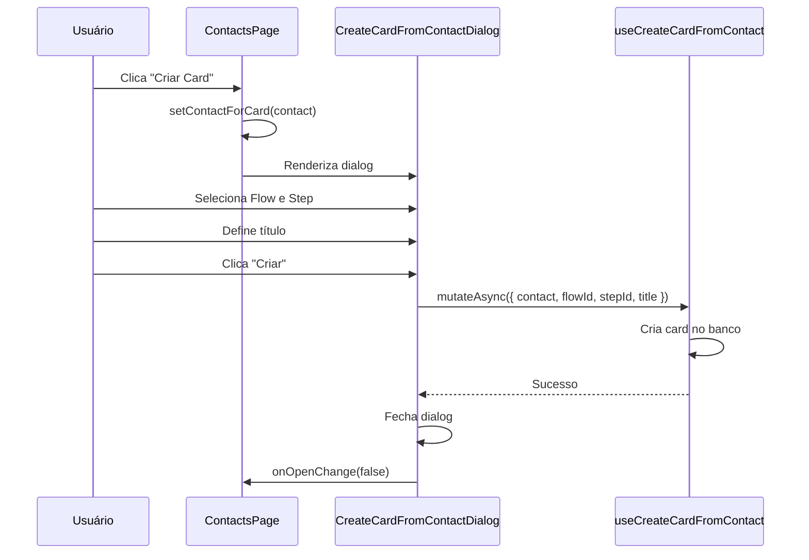

# Documentação: Tela de Contatos

## Visão Geral

A tela de contatos é um módulo do CRM que permite visualizar e gerenciar contatos de clientes e indicações. Ela oferece duas visualizações distintas: **modo cards** e **modo lista**, ambas com funcionalidades completas de filtragem, tags, paginação e ações.

## Estrutura de Arquivos

```
src/
├── pages/
│   └── crm/
│       ├── contacts/
│       │   └── ContactsPage.tsx          # Modo Cards
│       └── ContactsList.tsx              # Modo Lista
├── components/
│   └── crm/
│       └── contacts/
│           ├── ContactCard.tsx           # Componente de card individual
│           ├── ContactDetailsPanel.tsx   # Painel de detalhes (dialog)
│           ├── CreateCardFromContactDialog.tsx  # Dialog para criar card
│           ├── ContactCompaniesTab.tsx   # Tab de empresas
│           ├── ContactIndicatedBySelect.tsx      # Seletor de indicador
│           └── ContactTimeline.tsx      # Timeline de histórico
└── hooks/
    ├── useContactsWithIndications.ts     # Hook unificado (contatos + indicações)
    ├── useOpportunities.ts               # Hook base de contatos
    ├── useIndications.ts                 # Hook de indicações
    ├── useContactDetails.ts              # Hook de detalhes do contato
    └── useCreateCardFromContact.ts       # Hook para criar card
```

## Fluxo de Dados

### Diagrama de Fluxo Principal

```mermaid
graph TD
    A[ContactsPage/ContactsList] --> B[useContactsWithIndications]
    B --> C[useOpportunities]
    B --> D[useIndications]
    C --> E[Supabase RPC/Query]
    D --> F[Edge Function get-indications]
    E --> G[nexflow.contacts]
    F --> H[core_indications]
    B --> I[UnifiedContact[]]
    I --> J[Filtros por Tipo]
    J --> K[Paginação]
    K --> L[Renderização Cards/Lista]
    L --> M[ContactCard/TableRow]
    M --> N[ContactDetailsPanel]
    M --> O[CreateCardFromContactDialog]
```

### Fluxo de Permissões



## Tipos TypeScript

### Contact (Base)

```typescript
interface Contact {
  id: string;
  client_id: string;
  client_name: string;
  main_contact: string;
  phone_numbers: string[];
  company_names: string[];
  tax_ids: string[];
  related_card_ids: string[];
  assigned_team_id: string | null;
  avatar_type?: string;
  avatar_seed?: string;
  created_at: string;
  updated_at: string;
  contact_type?: ("cliente" | "parceiro")[] | null;
  indicated_by?: string | null;
}
```

### UnifiedContact

```typescript
interface UnifiedContact extends Contact {
  isIndication: boolean;              // true se for indicação
  indicationId?: string;               // ID da indicação (se aplicável)
  hunter?: Hunter | null;              // Dados do hunter (se aplicável)
  indicationStatus?: "pending" | "processed" | "converted" | "rejected";
}
```

### ContactDetails

```typescript
interface ContactDetails extends Contact {
  linkedCards: NexflowCard[];         // Cards vinculados
  interactionHistory: Array<{         // Histórico de interações
    id: string;
    type: string;
    description: string;
    createdAt: string;
  }>;
  indicated_by: string | null;
  contact_type: ("cliente" | "parceiro")[] | null;
  indicated_by_contact?: {           // Contato que indicou
    id: string;
    client_name: string;
    main_contact: string | null;
  } | null;
  companies?: Array<{                 // Empresas vinculadas
    id: string;
    company_id: string;
    role: string | null;
    is_primary: boolean;
    company: {
      id: string;
      name: string;
      cnpj: string | null;
      razao_social: string | null;
    };
  }>;
}
```

## Hooks Principais

### useContactsWithIndications

**Localização:** `src/hooks/useContactsWithIndications.ts`

**Propósito:** Combina contatos normais e indicações em uma lista unificada.

**Parâmetros:**
```typescript
interface UseContactsWithIndicationsOptions {
  enabled?: boolean;
  filterTypes?: ("cliente" | "parceiro" | "indicações")[];
}
```

**Retorno:**
```typescript
{
  contacts: UnifiedContact[];          // Lista filtrada
  unifiedContacts: UnifiedContact[];   // Lista completa (sem filtros)
  isLoading: boolean;
  isError: boolean;
  error: Error | null;
  contactsCount: number;               // Total de contatos
  indicationsCount: number;            // Total de indicações
}
```

**Funcionamento:**
1. Chama `useOpportunities` para buscar contatos
2. Chama `useIndications` para buscar indicações
3. Combina ambos em `UnifiedContact[]`
4. Aplica filtros por tipo se especificados
5. Retorna lista unificada e contadores

### useOpportunities

**Localização:** `src/hooks/useOpportunities.ts`

**Propósito:** Busca contatos do banco de dados com filtros de permissão.

**Funcionamento:**
1. Verifica permissões do usuário (administrator ou leader)
2. Se administrator: busca todos os contatos do `client_id`
3. Se leader: busca apenas contatos do time (`assigned_team_id`)
4. Busca empresas vinculadas via `contact_companies`
5. Retorna `Contact[]` com dados completos

**Permissões:**
- **Administrator:** Vê todos os contatos do `client_id`
- **Team Leader:** Vê apenas contatos do seu time
- **Outros:** Não têm acesso

**Cache:** 5 minutos (`staleTime`)

### useIndications

**Localização:** `src/hooks/useIndications.ts`

**Propósito:** Busca indicações do módulo Hunters.

**Funcionamento:**
1. Chama Edge Function `get-indications`
2. Retorna `Indication[]` do módulo Hunters
3. Cache de 30 segundos

### useContactDetails

**Localização:** `src/hooks/useContactDetails.ts`

**Propósito:** Busca detalhes completos de um contato específico.

**Parâmetros:** `contactId: string | null | undefined`

**Retorno:** `ContactDetails | null`

**Funcionamento:**
1. Busca contato por ID
2. Busca contato indicador (se `indicated_by` existir)
3. Busca empresas vinculadas via `contact_companies`
4. Busca cards vinculados via `cards.contact_id`
5. Monta histórico de interações
6. Retorna objeto completo com todas as relações

**Cache:** 2 minutos

## Modo Cards (ContactsPage)

**Arquivo:** `src/pages/crm/contacts/ContactsPage.tsx`

### Funcionalidades

1. **Visualização em Grid**
   - Layout responsivo: 1 coluna (mobile), 2 (tablet), 3 (desktop)
   - Animações com Framer Motion
   - Cards com hover effects

2. **Filtros por Tipo**
   - Botões toggle para: Cliente, Parceiro, Indicações
   - Contador de contatos e indicações
   - Botão "Limpar filtros"

3. **Tags Visuais**
   - Badge amarelo para indicações
   - Badges coloridos para tipos (azul=cliente, roxo=parceiro)
   - Exibidos no `ContactCard`

4. **Ações**
   - Clique no card: abre `ContactDetailsPanel`
   - Botão "Criar Card" (hover): abre `CreateCardFromContactDialog`
   - Indicações não abrem detalhes (comportamento intencional)

5. **Dialogs**
   - `ContactDetailsPanel`: Detalhes completos
   - `CreateCardFromContactDialog`: Criar card do contato
   - `GenerateFormDialog`: Gerar formulário
   - `AutoCreateConfigDialog`: Configurar auto-criação

### Estado

```typescript
const [hasAccess, setHasAccess] = useState<boolean>();
const [filterTypes, setFilterTypes] = useState<("cliente" | "parceiro" | "indicações")[]>([]);
const [isDetailsPanelOpen, setIsDetailsPanelOpen] = useState(false);
const [selectedContact, setSelectedContact] = useState<string | null>(null);
const [contactForCard, setContactForCard] = useState<any>(null);
```

### Componente ContactCard

**Arquivo:** `src/components/crm/contacts/ContactCard.tsx`

**Props:**
```typescript
interface ContactCardProps {
  contact: UnifiedContact;
  onClick?: () => void;
  onCreateCard?: () => void;
  index?: number;
}
```

**Características:**
- Avatar gerado com `UserAvatar`
- Nome do cliente e contato principal
- Tags de tipo e indicação
- Lista de empresas (máx 2 + contador)
- Lista de telefones (máx 2 + contador)
- Data de criação formatada
- Botão "Criar Card" no hover
- Animações de entrada e hover

## Modo Lista (ContactsList)

**Arquivo:** `src/pages/crm/ContactsList.tsx`

### Funcionalidades

1. **Tabela Responsiva**
   - Colunas: Cliente (com avatar), Contato Principal, Tags, Telefones, Empresas, Time, Data, Ações
   - Linhas clicáveis (exceto indicações)
   - Hover effects

2. **Filtros por Tipo**
   - Mesma interface do modo cards
   - Botões toggle para: Cliente, Parceiro, Indicações
   - Contador de contatos e indicações
   - Botão "Limpar filtros"

3. **Tags na Tabela**
   - Coluna dedicada para tags
   - Badge amarelo para indicações
   - Badges coloridos para tipos

4. **Paginação**
   - Client-side (20 itens por página)
   - Componente `Pagination` do shadcn/ui
   - Navegação: Previous, números, Next
   - Ellipsis para muitas páginas
   - Reset automático ao mudar filtros

5. **Ações**
   - Clique na linha: abre `ContactDetailsPanel`
   - Botão "Criar Card" na coluna de ações
   - Indicações não abrem detalhes

### Estado

```typescript
const [hasAccess, setHasAccess] = useState<boolean>();
const [filterTypes, setFilterTypes] = useState<("cliente" | "parceiro" | "indicações")[]>([]);
const [isDetailsPanelOpen, setIsDetailsPanelOpen] = useState(false);
const [selectedContact, setSelectedContact] = useState<string | null>(null);
const [contactForCard, setContactForCard] = useState<any>(null);
const [currentPage, setCurrentPage] = useState(1);
const pageSize = 20;
```

### Cálculo de Paginação

```typescript
const totalPages = Math.ceil(contacts.length / pageSize);
const paginatedContacts = contacts.slice(
  (currentPage - 1) * pageSize,
  currentPage * pageSize
);
```

## Sistema de Filtros

### Tipos de Filtro

1. **Cliente**: Filtra contatos com `contact_type` contendo "cliente"
2. **Parceiro**: Filtra contatos com `contact_type` contendo "parceiro"
3. **Indicações**: Filtra contatos com `isIndication === true`

### Lógica de Filtragem

```typescript
// Em useContactsWithIndications
const filteredContacts = useMemo(() => {
  if (!filterTypes || filterTypes.length === 0) {
    return unifiedContacts;
  }

  return unifiedContacts.filter((contact) => {
    // Filtro para indicações
    if (filterTypes.includes("indicações") && contact.isIndication) {
      return true;
    }

    // Filtro para tipos de contato
    if (!contact.isIndication && contact.contact_type) {
      const hasMatchingType = filterTypes.some((filterType) => {
        if (filterType === "indicações") return false;
        return contact.contact_type?.includes(filterType);
      });
      return hasMatchingType;
    }

    return false;
  });
}, [unifiedContacts, filterTypes]);
```

### Comportamento

- Múltiplos filtros podem ser ativos simultaneamente (OR)
- Filtros são aplicados no hook, não na query
- Reset de página ao mudar filtros

## Integração com Indicações

### Origem das Indicações

As indicações vêm do módulo **Hunters** e são buscadas via Edge Function `get-indications`.

### Mapeamento para UnifiedContact

```typescript
const unifiedContact: UnifiedContact = {
  id: `indication_${indication.id}`,  // Prefixo para evitar conflitos
  client_id: indication.client_id,
  client_name: indication.indication_name || "Indicação sem nome",
  main_contact: indication.responsible || null,
  phone_numbers: indication.phone ? [indication.phone] : [],
  company_names: [],
  tax_ids: indication.cnpj_cpf ? [indication.cnpj_cpf] : [],
  related_card_ids: indication.related_card_ids || [],
  assigned_team_id: null,
  avatar_type: undefined,
  avatar_seed: undefined,
  created_at: indication.created_at,
  updated_at: indication.updated_at,
  contact_type: null,
  indicated_by: null,
  isIndication: true,
  indicationId: indication.id,
  hunter: indication.hunter || null,
  indicationStatus: indication.status,
};
```

### Comportamento Especial

- Indicações não abrem `ContactDetailsPanel` (não são contatos completos)
- Podem ter cards vinculados via `related_card_ids`
- Status: pending, processed, converted, rejected

## Permissões e Controle de Acesso

### Verificação de Acesso

Ambas as páginas verificam acesso antes de renderizar:

1. **Cache em sessionStorage**
   - `contacts-page-has-access` (modo cards)
   - `contacts-list-has-access` (modo lista)

2. **Verificação de Role**
   - `administrator`: Acesso total
   - `leader` (em `core_team_members`): Acesso limitado ao time
   - Outros: Sem acesso

3. **Fluxo**
   ```typescript
   useEffect(() => {
     if (hasAccess) return; // Skip se já tem acesso
     
     // Verifica session
     // Verifica role em core_client_users
     // Se não for admin, verifica core_team_members
     // Salva em sessionStorage
   }, []);
   ```

### Filtros de Permissão no Hook

```typescript
// useOpportunities
if (userPermissions.isAdmin) {
  // Busca todos os contatos do client_id
} else if (userPermissions.isLeader) {
  // Busca apenas contatos do time
  query = query.in('assigned_team_id', userPermissions.teamIds);
} else {
  // Não retorna nada
  return [];
}
```

## ContactDetailsPanel

**Arquivo:** `src/components/crm/contacts/ContactDetailsPanel.tsx`

### Estrutura

Dialog com 3 tabs:

1. **Informações**
   - Avatar e nome
   - Telefones
   - Tipo de contato (checkboxes editáveis)
   - Parceiro indicador (seletor)
   - Empresas vinculadas
   - Cards vinculados (clicáveis)
   - Data de criação

2. **Empresas**
   - Lista de empresas vinculadas
   - Gerenciamento de vínculos
   - Componente: `ContactCompaniesTab`

3. **Histórico**
   - Timeline de interações
   - Criação do contato
   - Criação de cards
   - Componente: `ContactTimeline`

### Mutations

**Atualizar Tipo de Contato:**
```typescript
const updateContactType = useMutation({
  mutationFn: async (contactTypes: ("cliente" | "parceiro")[]) => {
    await nexflowClient()
      .from("contacts")
      .update({ contact_type: contactTypes })
      .eq("id", contactId);
  },
  onSuccess: () => {
    queryClient.invalidateQueries({ queryKey: ["contact-details", contactId] });
    queryClient.invalidateQueries({ queryKey: ["contacts"] });
  },
});
```

## CreateCardFromContactDialog

**Arquivo:** `src/components/crm/contacts/CreateCardFromContactDialog.tsx`

### Funcionalidade

Permite criar um card no Nexflow a partir de um contato.

**Fluxo:**
1. Seleciona Flow
2. Seleciona Step (baseado no Flow)
3. Define título do card
4. Chama `useCreateCardFromContact` mutation
5. Cria card vinculado ao contato

## Paginação

### Implementação

**Modo Lista:**
- Client-side pagination
- 20 itens por página
- Componente `Pagination` do shadcn/ui
- Navegação com ellipsis para muitas páginas

**Modo Cards:**
- Atualmente sem paginação (mostra todos)
- Pode ser implementada futuramente

### Componente Pagination

```typescript
<Pagination>
  <PaginationContent>
    <PaginationPrevious />
    {/* Números de página ou ellipsis */}
    <PaginationNext />
  </PaginationContent>
</Pagination>
```

### Lógica de Páginas

- Se `totalPages <= 7`: Mostra todas as páginas
- Se `totalPages > 7`:
  - Página atual <= 4: Mostra 1, 2, 3, 4, 5, ..., última
  - Página atual >= totalPages - 3: Mostra 1, ..., últimas 5
  - Caso contrário: Mostra 1, ..., atual-1, atual, atual+1, ..., última

## Tags e Badges

### Tipos de Tags

1. **Indicação**
   - Badge amarelo
   - Texto: "Indicação"
   - Ícone: Tag
   - Classe: `bg-yellow-50 text-yellow-700 border-yellow-200`

2. **Cliente**
   - Badge azul
   - Texto: "Cliente"
   - Classe: `bg-blue-100 text-blue-800 border-blue-200`

3. **Parceiro**
   - Badge roxo
   - Texto: "Parceiro"
   - Classe: `bg-purple-100 text-purple-800 border-purple-200`

### Renderização

```typescript
{contact.isIndication && (
  <Badge variant="outline" className="bg-yellow-50...">
    <Tag className="h-3 w-3 mr-1" />
    Indicação
  </Badge>
)}

{contact.contact_type && (
  // Suporta array ou string
  const types = Array.isArray(contact.contact_type) 
    ? contact.contact_type 
    : [contact.contact_type];
  
  types.map((type) => (
    <Badge key={type} className={typeColors[type]}>
      {typeLabels[type]}
    </Badge>
  ))
)}
```

## Performance e Otimizações

### Cache

- **useOpportunities:** 5 minutos
- **useIndications:** 30 segundos
- **useContactDetails:** 2 minutos
- **Permissões:** 1 hora (sessionStorage)

### Memoização

- `useMemo` para filtros
- `useMemo` para paginação
- `useMemo` para cálculos derivados

### Lazy Loading

- Dialogs carregados apenas quando abertos
- Tabs do `ContactDetailsPanel` carregam sob demanda

## Fluxo Completo de Uso

### 1. Acessar Página



### 2. Filtrar Contatos



### 3. Abrir Detalhes



### 4. Criar Card



## Considerações de Segurança

### Row Level Security (RLS)

- Contatos filtrados por `client_id` no banco
- Leaders veem apenas contatos do time
- Administrators veem todos do `client_id`
- RLS aplicado no Postgres, não apenas no frontend

### Validação de Acesso

- Verificação de role antes de renderizar
- Cache de permissões em sessionStorage (1 hora)
- Revalidação em caso de erro

### Sanitização

- IDs validados antes de queries
- Tipos validados antes de mutations
- Erros tratados com try/catch

## Melhorias Futuras

1. **Paginação no Modo Cards**
   - Implementar paginação infinita ou paginada
   - Reduzir carga inicial

2. **Busca/Ordenação**
   - Campo de busca por nome/telefone
   - Ordenação por colunas na lista

3. **Exportação**
   - Exportar contatos filtrados para CSV/Excel

4. **Bulk Actions**
   - Seleção múltipla
   - Ações em lote (ex: atualizar tipo)

5. **Filtros Avançados**
   - Por time
   - Por data de criação
   - Por status de indicação

6. **Indicações no ContactDetailsPanel**
   - Permitir abrir detalhes de indicações
   - Mostrar dados do hunter

## Conclusão

A tela de contatos é um módulo completo e bem estruturado que oferece duas visualizações complementares (cards e lista) com funcionalidades robustas de filtragem, tags, paginação e ações. A arquitetura baseada em hooks reutilizáveis facilita a manutenção e extensão do código.
