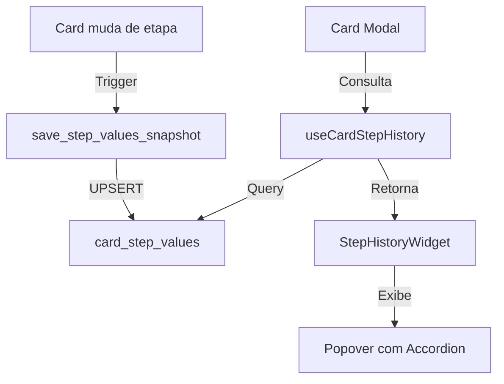

# Feature: Histórico de Campos por Etapa

## Visão Geral

A feature **Histórico de Campos por Etapa** permite que usuários visualizem valores preenchidos em etapas anteriores de um card, sem precisar mover o card de volta. Isso facilita a consulta de informações históricas e melhora a experiência do usuário ao trabalhar com cards em diferentes etapas do fluxo.

## Arquitetura

### Fluxo de Dados



### Componentes Principais

1. **Tabela `card_step_values`**: Armazena snapshots dos valores quando o card sai de uma etapa
2. **Trigger `trigger_save_step_values_on_stage_change`**: Salva automaticamente o snapshot ao mudar etapa
3. **Hook `useCardStepHistory`**: Busca valores históricos agrupados por etapa
4. **Componente `StepHistoryWidget`**: Widget flutuante que exibe o histórico

## Estrutura de Dados

### Tabela `card_step_values`

```sql
CREATE TABLE public.card_step_values (
    id UUID PRIMARY KEY,
    card_id UUID NOT NULL REFERENCES cards(id),
    step_id UUID NOT NULL REFERENCES steps(id),
    field_values JSONB NOT NULL DEFAULT '{}'::jsonb,
    client_id UUID NOT NULL REFERENCES core_clients(id),
    created_at TIMESTAMPTZ NOT NULL DEFAULT NOW(),
    updated_at TIMESTAMPTZ NOT NULL DEFAULT NOW(),
    UNIQUE(card_id, step_id)
);
```

**Campos**:
- `id`: Identificador único do snapshot
- `card_id`: ID do card
- `step_id`: ID da etapa onde os valores foram preenchidos
- `field_values`: Snapshot dos valores dos campos (JSONB)
- `client_id`: ID do cliente (multi-tenant)
- `created_at`: Data de criação do snapshot
- `updated_at`: Data da última atualização

**Índices**:
- `idx_card_step_values_card_id`: Otimiza queries por card
- `idx_card_step_values_step_id`: Otimiza queries por etapa
- `idx_card_step_values_card_step`: Índice único para evitar duplicatas

### Trigger e Função

**Função**: `save_step_values_snapshot()`
- Dispara quando `step_id` do card muda
- Salva snapshot de `field_values` na etapa anterior (`OLD.step_id`)
- Usa UPSERT para atualizar se já existir snapshot daquela etapa
- Ignora se `OLD.step_id` for NULL (criação inicial)

**Trigger**: `trigger_save_step_values_on_stage_change`
- Evento: `BEFORE UPDATE` em `cards`
- Condição: `OLD.step_id IS DISTINCT FROM NEW.step_id`

## Como Funciona

### 1. Persistência de Valores

Quando um card muda de etapa:

1. O trigger `trigger_save_step_values_on_stage_change` é disparado
2. A função `save_step_values_snapshot()` é executada
3. Um snapshot dos `field_values` da etapa anterior é salvo em `card_step_values`
4. Se já existir snapshot para aquela combinação `(card_id, step_id)`, o registro é atualizado

### 2. Busca de Valores Históricos

O hook `useCardStepHistory`:

1. Busca todos os snapshots do card em `card_step_values`
2. Faz JOIN com `steps` para obter nome e posição das etapas
3. Faz JOIN com `step_fields` para obter labels e tipos dos campos
4. Filtra etapa atual (apenas históricas)
5. Ordena por posição da etapa (mais recente primeiro)
6. Formata os dados para exibição

### 3. Exibição no Frontend

O componente `StepHistoryWidget`:

1. Exibe um badge clicável "Histórico"
2. Ao clicar, abre um Popover com lista de etapas anteriores
3. Cada etapa é exibida em um AccordionItem
4. Dentro de cada etapa, lista os campos preenchidos com seus valores
5. Valores são formatados de acordo com o tipo do campo (data, CNPJ/CPF, etc.)

## Uso no Frontend

### Componente StepHistoryWidget

```tsx
import { StepHistoryWidget } from "@/components/crm/flows/StepHistoryWidget";

<StepHistoryWidget 
  cardId={card.id} 
  currentStepId={card.stepId} 
/>
```

### Hook useCardStepHistory

```tsx
import { useCardStepHistory } from "@/hooks/useCardStepHistory";

const { data: stepHistory, isLoading } = useCardStepHistory(
  cardId,
  currentStepId
);

// stepHistory é um array de StepHistory:
type StepHistory = {
  step_id: string;
  step_name: string;
  step_position: number;
  field_values: Record<string, unknown>;
  created_at: string;
  updated_at: string;
  fields: Array<{
    field_id: string;
    label: string;
    value: unknown;
    field_type: string;
    slug: string | null;
  }>;
};
```

## Formatação de Valores

Os valores são formatados automaticamente de acordo com o tipo do campo:

- **Data**: Formato brasileiro (dd/MM/yyyy)
- **CNPJ/CPF**: Formatação automática com máscara
- **Checklist**: Lista de itens separados por vírgula
- **Boolean**: "Sim" ou "Não"
- **Array**: Itens separados por vírgula
- **String/Number**: Exibição direta

## Políticas de Segurança (RLS)

- **SELECT**: Membros do time podem ler valores de cards do mesmo `client_id`
- **INSERT/UPDATE**: Apenas via trigger (service role) - não há policy para usuários

## Exemplo de Payload

### Snapshot Salvo Automaticamente

Quando um card muda de etapa, o trigger salva automaticamente:

```json
{
  "card_id": "uuid-do-card",
  "step_id": "uuid-da-etapa-anterior",
  "field_values": {
    "campo-1-id": "Valor do campo 1",
    "campo-2-id": "Valor do campo 2",
    "campo-checklist-id": {
      "item-1": true,
      "item-2": false
    }
  },
  "client_id": "uuid-do-cliente"
}
```

## Migrations

### 1. `20260123_create_card_step_values.sql`
Cria a tabela `card_step_values` com estrutura, índices e RLS policies.

### 2. `20260123_create_card_step_values_trigger.sql`
Cria a função `save_step_values_snapshot()` e o trigger `trigger_save_step_values_on_stage_change`.

## Considerações Técnicas

### Performance
- Índices otimizados para queries rápidas por `card_id` e `step_id`
- Cache via React Query (5 minutos de staleTime)
- Queries com JOINs otimizados

### Compatibilidade
- Não quebra funcionalidades existentes de edição
- Funciona com todos os tipos de campos (text, number, date, checklist, etc.)
- Suporta campos de sistema e campos customizados

### Limitações
- Snapshots são criados apenas quando o card muda de etapa
- Valores editados na mesma etapa não geram novo snapshot até mudar de etapa
- Se um card voltar para uma etapa anterior e depois sair novamente, o snapshot é atualizado (UPSERT)

## Troubleshooting

### Snapshots não estão sendo criados

1. Verificar se o trigger está ativo:
   ```sql
   SELECT * FROM pg_trigger WHERE tgname = 'trigger_save_step_values_on_stage_change';
   ```

2. Verificar se a função existe:
   ```sql
   SELECT * FROM pg_proc WHERE proname = 'save_step_values_snapshot';
   ```

3. Verificar logs do Supabase para erros no trigger

### Valores não aparecem no widget

1. Verificar se há snapshots para o card:
   ```sql
   SELECT * FROM card_step_values WHERE card_id = 'uuid-do-card';
   ```

2. Verificar se o hook está sendo chamado corretamente
3. Verificar console do navegador para erros

### Performance lenta

1. Verificar se os índices estão criados:
   ```sql
   SELECT * FROM pg_indexes WHERE tablename = 'card_step_values';
   ```

2. Verificar se há muitos snapshots (considerar limpeza periódica)
3. Verificar se o React Query está fazendo cache adequado

## Próximos Passos (Melhorias Futuras)

1. **Limpeza Automática**: Implementar job para remover snapshots antigos (ex: mais de 1 ano)
2. **Exportação**: Permitir exportar histórico completo do card
3. **Comparação**: Mostrar diferenças entre valores de etapas diferentes
4. **Filtros**: Permitir filtrar por tipo de campo ou data
5. **Busca**: Adicionar busca dentro do histórico

## Referências

- Tabela `cards`: Armazena valores atuais dos campos
- Tabela `card_history`: Armazena histórico de eventos (incluindo mudanças de etapa)
- Tabela `step_fields`: Define campos disponíveis em cada etapa
- Componente `ContactFloatingWidget`: Referência de design para widgets flutuantes
