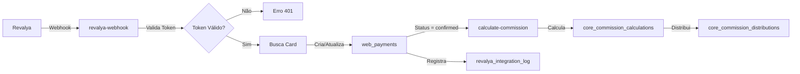

# Mapeamento Completo da Infraestrutura Supabase - NextFlow

## Índice

1. [Resumo Executivo](#1-resumo-executivo)
2. [Banco de Dados](#2-banco-de-dados)
   - [2.1 Schemas Identificados](#21-schemas-identificados)
   - [2.2 Migrations SQL](#22-migrations-sql)
   - [2.3 Tabelas Principais](#23-tabelas-principais)
3. [Conexões e Segurança](#3-conexões-e-segurança)
   - [3.1 Variáveis de Ambiente](#31-variáveis-de-ambiente)
   - [3.2 Chaves e URLs](#32-chaves-e-urls)
   - [3.3 Row Level Security (RLS)](#33-row-level-security-rls)
4. [Interações com Banco de Dados](#4-interações-com-banco-de-dados)
   - [4.1 Cliente Supabase Principal](#41-cliente-supabase-principal)
   - [4.2 Hooks Customizados](#42-hooks-customizados)
   - [4.3 Padrões de Query](#43-padrões-de-query)
5. [Edge Functions (Serverless)](#5-edge-functions-serverless)
   - [5.1 Funções por Categoria](#51-funções-por-categoria)
   - [5.2 Variáveis de Ambiente das Edge Functions](#52-variáveis-de-ambiente-das-edge-functions)
6. [Integrações Externas](#6-integrações-externas)
   - [6.1 Revalya (Sistema Financeiro)](#61-revalya-sistema-financeiro)
   - [6.2 APIs Públicas](#62-apis-públicas)
7. [Arquivos SQL Adicionais](#7-arquivos-sql-adicionais)
8. [Extensões PostgreSQL](#8-extensões-postgresql)

---

## 1. Resumo Executivo

### Visão Geral da Arquitetura

O NextFlow é uma plataforma CRM multi-tenant construída sobre Supabase, utilizando PostgreSQL como banco de dados principal. A arquitetura utiliza o schema `public` como schema principal:

- **Schema `public`**: Sistema completo incluindo:
  - Sistema base e CRM (tabelas `core_*` e `web_*`)
  - Módulo de flows, cards e processos (tabelas `flows`, `steps`, `cards`, etc.)
  - Sistema de notificações e mensagens
  - Tabelas de comissões e pagamentos
- **Schema `nexhunters`**: Módulo de hunters/indicações (identificado via foreign keys)

**Nota**: O schema `nexflow` foi migrado para `public` em janeiro de 2025. Todas as tabelas, funções e triggers foram movidas para o schema `public`.

### Estatísticas

- **Total de Tabelas**: 100+ tabelas identificadas via MCP
- **Migrations SQL**: 37 migrations no diretório `supabase/migrations/`
- **Edge Functions**: 30+ funções serverless ativas
- **Hooks Customizados**: 170+ arquivos com interações ao banco
- **RLS Habilitado**: Aproximadamente 60% das tabelas principais

### Informações de Conexão

- **URL do Projeto**: `https://fakjjzrucxpektnhhnjl.supabase.co`
- **Project ID**: `fakjjzrucxpektnhhnjl`
- **Configuração Local**: `src/lib/supabase.ts`
- **Configuração Supabase**: `supabase/config.toml`

---

## 2. Banco de Dados

### 2.1 Schemas Identificados

#### Schema `public`
Schema principal contendo:
- **Tabelas Core**: `core_clients`, `core_client_users`, `core_licenses`, `core_teams`, etc.
- **Tabelas CRM**: `web_companies`, `web_people`, `web_deals`, `web_tasks`, `web_flows`, etc.
- **Tabelas de Comissões**: `core_team_levels`, `core_team_commissions`, `core_commission_calculations`, etc.
- **Tabelas de Pagamentos**: `web_payments`, `revalya_integration_log`
- **Tabelas de App**: `app_partners`, `app_missions`, `app_store_itens`, etc.

#### Tabelas NexFlow (Schema `public`)
Módulo de gestão de processos e cards (migrado do schema `nexflow` para `public`):
- `flows`: Fluxos de trabalho
- `steps`: Etapas dos fluxos
- `cards`: Cards/oportunidades dentro dos fluxos
- `card_items`: Itens vinculados aos cards
- `notifications`: Sistema de notificações
- `card_messages`: Mensagens nos cards
- `card_message_attachments`: Anexos das mensagens
- `card_attachments`: Anexos dos cards
- `contacts`: Contatos do módulo NexFlow (estrutura detalhada na seção 2.3)
- `flow_team_access`: Controle de acesso de times aos flows
- `flow_user_exclusions`: Exclusões de usuários dos flows
- `step_team_access`: Controle de acesso de times aos steps
- `step_user_exclusions`: Exclusões de usuários dos steps
- `step_actions`: Ações configuradas para steps
- `card_step_actions`: Execução de ações nos cards
- `step_fields`: Campos customizados dos steps
- `card_history`: Histórico de movimentações dos cards
- `contact_automations`: Automações de criação de cards a partir de contatos
- `step_child_card_automations`: Automações de criação de cards filhos
- `user_notification_settings`: Configurações de notificações por usuário
- `flow_tags`: Tags dos flows
- `card_tags`: Relacionamento entre cards e tags

#### Schema `nexhunters`
Módulo de hunters/indicações (identificado via foreign keys):
- `nexhunters.hunters`: Tabela de hunters

---

### 2.2 Migrations SQL

Todas as migrations estão localizadas em `supabase/migrations/` e são executadas automaticamente pelo Supabase na ordem cronológica.

#### Migrations por Funcionalidade

##### Core System & Multi-Tenancy
- `20250630033003_enable_rls_existing_tables.sql`: Habilita RLS em tabelas existentes
- `20250630033019_create_rls_policies.sql`: Cria políticas RLS básicas
- `20250630033220_correct_rls_policies.sql`: Corrige políticas RLS
- `20250630033328_flows_and_history_rls_policies.sql`: Políticas para flows e histórico
- `20250630043813_fix_user_select_policy.sql`: Corrige política de seleção de usuários

##### Sistema de Revendedores
- `20250616063949_create_resellers_system.sql`: Cria sistema de revendedores
- `20250620041107_fix_reseller_users_policy_recursion.sql`: Corrige recursão em políticas
- `20250620041858_create_core_client_users_policy.sql`: Políticas para usuários

##### Sistema de Flows e CRM
- `20250616081539_rename_funnels_to_flows.sql`: Renomeia funnels para flows
- `20250715020914_create_web_flows_table.sql`: Cria tabela de flows
- `20250715020935_create_web_flow_stages_table.sql`: Cria tabela de estágios
- `20250715021014_create_web_form_fields_table.sql`: Cria campos de formulário
- `20250715021103_create_flows_table.sql`: Cria tabela flows (migrada para schema `public`)
- `20250715021642_create_deal_flow_views_table.sql`: Views de deals em flows
- `20250715021708_create_flow_automations_table.sql`: Automações entre flows

##### Sistema de Comissões
- `20250127_create_commission_system.sql`: Sistema completo de comissões
  - Cria `core_team_levels`: Níveis hierárquicos dos times
  - Cria `core_team_member_levels`: Vinculação de membros a níveis
  - Cria `core_team_commissions`: Comissões por time e produto
  - Cria `core_commission_calculations`: Cálculos de comissão
  - Cria `core_commission_distributions`: Distribuição entre membros
- `20250127_create_commission_system_cards.sql`: Integração com cards
- `20250127_create_items_table.sql`: Tabela de itens (produtos/serviços)
- `20250127_create_team_levels_and_roles.sql`: Níveis e roles de times
- `20260105012159_refactor_commissions_flexible.sql`: Refatoração flexível
- `20260105024354_refactor_levels_global_and_team_current_level.sql`: Refatoração de níveis

##### Sistema de Pagamentos
- `20250127_create_payment_system.sql`: Sistema de pagamentos
  - Cria `web_payments`: Pagamentos recebidos
  - Cria `revalya_integration_log`: Log de integração com Revalya
  - Integração com cards para cálculo de comissões

##### NexFlow Cards (Migrado para Public)
- `20250126_create_nexflow_cards.sql`: Cria tabela de cards (migrada para schema `public`)
- `20250126_add_step_color.sql`: Adiciona cor aos steps (migrado para schema `public`)
- `20250129_add_assigned_to_to_nexflow_cards.sql`: Adiciona campo assigned_to (migrado para schema `public`)
- `20251227112339_add_indication_id_to_cards.sql`: Vincula cards a indicações (migrado para schema `public`)
- `20260123_create_card_step_values.sql`: Cria tabela para snapshots de valores por etapa
- `20260123_create_card_step_values_trigger.sql`: Cria triggers para salvar snapshots automaticamente
- **`20260109201059_migrate_nexflow_to_public.sql`**: **Migration principal** - Move todas as tabelas do schema `nexflow` para `public`
- **`20260109201126_migrate_nexflow_functions_to_public.sql`**: Recria funções SQL no schema `public`
- **`20260109201145_migrate_nexflow_triggers_to_public.sql`**: Recria triggers no schema `public`
- **`20260109202128_drop_nexflow_schema.sql`**: Remove o schema `nexflow` após migração completa

##### Sistema de Notificações
- `20251230095246_create_notifications_system.sql`: Sistema de notificações
  - Cria `notifications`: Notificações para usuários (schema `public`)
  - Cria `user_notification_settings`: Configurações por usuário (schema `public`)
- `20251230095247_create_card_messages_system.sql`: Sistema de mensagens
- `20251230095248_create_card_attachments.sql`: Sistema de anexos
- `20251230095249_create_notification_triggers.sql`: Triggers de notificação
- `20251230095250_add_rls_policies_notifications_messages.sql`: Políticas RLS
- `20251230103131_create_get_user_client_id_function.sql`: Função auxiliar
- `20251230104849_fix_notifications_permissions_complete.sql`: Correção de permissões

##### Visibilidade e Acesso
- `20250610_create_flow_visibility_tables.sql`: Tabelas de visibilidade de flows
- `20250127_add_step_visibility_tables.sql`: Tabelas de visibilidade de steps
- `20250128_add_step_visibility_rls_policies.sql`: Políticas RLS de visibilidade

##### Automações
- `20250120_create_step_child_card_automations.sql`: Automações de cards filhos
- `20251226113129_create_card_step_actions.sql`: Ações de cards em steps
- `20251226113130_create_auto_link_step_actions_function.sql`: Função de auto-link
- `20251226162416_add_opportunity_card_integration.sql`: Integração com oportunidades
- `20251226162417_create_opportunity_auto_create_trigger.sql`: Trigger de criação automática
- `20260110_create_automation_functions.sql`: Funções de automação de contatos (parceiros e clientes)
- `20260110_create_automation_triggers.sql`: Triggers para automação de criação/atualização de cards

##### Indicações
- `20250127_add_core_indications_rls_policy.sql`: Política RLS para indicações
- `20251227120000_enable_rls_core_indications.sql`: Habilita RLS em indicações

##### Formulários Públicos
- `20251227151432_create_public_opportunity_forms.sql`: Formulários públicos

##### Franquias
- `20260105030732_create_franchises_table_fixed.sql`: Sistema de franquias

##### Relacionamentos e Indicações (Janeiro 2025)
- `20260110_create_contact_companies_relationship.sql`: Tabela de relacionamento N:N entre contatos e empresas
- `20260110_add_indicated_by_to_contacts.sql`: Adiciona campos indicated_by e contact_type em contacts (inicialmente como TEXT)
- `20260110_add_indicated_by_to_cards.sql`: Adiciona campo indicated_by em cards
- `20260110_create_contact_indications.sql`: Tabela de dados detalhados de indicações
- `20260110_improve_card_history.sql`: Melhora card_history com rastreamento de direção de movimento
- `20260110_add_flow_identifier.sql`: Adiciona campo flow_identifier em flows para automações
- `20260110_create_flow_helper_functions.sql`: Funções auxiliares para buscar flows e steps
- `20260116_change_contact_type_to_array.sql`: Converte contact_type de TEXT para TEXT[] para suportar múltiplos tipos
- `20260117_fix_contact_type_array_and_remove_outro.sql`: Remove valor 'outro' e ajusta validações
- `20260118_fix_automation_functions_contact_type_array.sql`: Corrige funções de automação para usar sintaxe correta de array

##### Sistema de Histórico e Auditoria (Janeiro 2025)
- `20260119_refactor_card_history_system.sql`: Refatora `card_history` com suporte a tipos de evento, duração e valores anteriores/novos
- `20260119_add_last_stage_change_to_cards.sql`: Adiciona `last_stage_change_at` em `cards` para otimização de performance
- `20260119_create_card_history_triggers.sql`: Cria triggers automáticos para rastreamento de eventos (mudanças de etapa, edições de campos, mudanças de status)
- `20260119_migrate_existing_card_history.sql`: Migra dados existentes, calcula `duration_seconds` retroativamente e preenche `last_stage_change_at`
- `20260119_add_card_history_foreign_keys.sql`: Adiciona foreign keys faltantes em `card_history` para joins automáticos
- `20260119_create_history_sql_functions.sql`: Cria funções SQL `get_card_timeline` e `get_contact_history` para queries otimizadas
- `20260119_add_activity_history_triggers.sql`: Cria triggers para rastrear criação, atualização e conclusão de atividades (`card_activities`)
- `20260119_add_process_history_triggers.sql`: Cria triggers para rastrear mudanças de status de processos (`card_step_actions`)

##### Outras Migrations
- `20241220_add_avatar_fields_to_core_client_users.sql`: Campos de avatar
- `20241225_add_flexible_search_function.sql`: Função de busca flexível
- `20250116_add_lucas_almeida_user.sql`: Script de usuário específico
- `20250718025400_add_avatar_fields_to_core_client_users.sql`: Adiciona campos de avatar
- `20250719015205_add_flexible_search_function.sql`: Função de busca flexível
- `20250725040111_create_audit_history_system.sql`: Sistema de auditoria
- `20250806021214_create_activity_types_table.sql`: Tipos de atividade
- `20250806021353_create_deal_activities_table.sql`: Atividades de deals
- `20251017183513_web_people_client_id_default_and_insert_policy_authenticated.sql`: Default para client_id

---

### 2.3 Tabelas Principais

#### Módulo Core (Clientes, Usuários, Licenças)

| Tabela | Schema | RLS | Descrição |
|--------|--------|-----|-----------|
| `core_clients` | public | ❌ | Clientes/Empresas no NexFlow |
| `core_client_users` | public | ❌ | Usuários criados pelo Cliente |
| `core_licenses` | public | ❌ | Tipos/níveis de licença |
| `core_client_license` | public | ❌ | Licenças ativas dos clientes |
| `core_client_user_invites` | public | ✅ | Convites de usuário |
| `core_resellers` | public | ✅ | Revendedores |
| `core_reseller_users` | public | ✅ | Usuários do portal de revendedores |

#### Módulo CRM (Empresas, Pessoas, Negócios)

| Tabela | Schema | RLS | Descrição |
|--------|--------|-----|-----------|
| `web_companies` | public | ✅ | Empresas/Organizações |
| `web_people` | public | ❌ | Pessoas/Contatos |
| `web_deals` | public | ✅ | Negócios/Oportunidades |
| `web_tasks` | public | ✅ | Tarefas |
| `web_flows` | public | ✅ | Fluxos de trabalho |
| `web_flow_stages` | public | ✅ | Estágios dos fluxos |
| `web_form_fields` | public | ✅ | Campos de formulário |
| `web_deal_activities` | public | ✅ | Atividades dos negócios |
| `web_deal_participants` | public | ❌ | Participantes dos negócios |
| `web_deal_tags` | public | ✅ | Tags dos negócios |
| `web_tags` | public | ✅ | Tags disponíveis |
| `web_notes` | public | ✅ | Notas de empresas/pessoas |
| `web_company_people` | public | ✅ | Relacionamento empresa-pessoa |
| `web_cities` | public | ❌ | Cidades (IBGE) |
| `web_states` | public | ❌ | Estados (IBGE) |
| `web_region` | public | ❌ | Regiões/Polos |

##### Nota sobre `web_companies`

A tabela `web_companies` **não possui** a coluna `company_type` no schema atual (PostgREST/schema cache). Inserts e tipos em `src/types/database.ts` não devem incluir `company_type`.

##### Relacionamentos entre `web_people` e `web_companies`

**⚠️ IMPORTANTE**: Existem dois relacionamentos entre essas tabelas, o que requer especificação explícita em queries do Supabase:

1. **`web_people.company_id` → `web_companies.id`**
   - Constraint: `partners_company_id_fkey`
   - Uso: Uma pessoa pode estar vinculada a uma empresa
   - **Sintaxe no Supabase**: `company:web_companies!partners_company_id_fkey(...)`

2. **`web_companies.partner_id` → `web_people.id`**
   - Constraint: `companies_partner_id_fkey`
   - Uso: Uma empresa pode ter um parceiro associado
   - **Sintaxe no Supabase**: `partner:web_people!companies_partner_id_fkey(...)`

**Nota**: Quando há múltiplos relacionamentos entre duas tabelas, o Supabase requer especificação explícita usando a sintaxe `!constraint_name` para evitar ambiguidade.

##### Campos de Telefone em `web_people`

A tabela `web_people` possui os seguintes campos relacionados a telefone:

- **`phone`** (TEXT, nullable): Telefone fixo ou celular
- **`whatsapp`** (VARCHAR, nullable): Número do WhatsApp

**Validação**:
- Formatos aceitos: `(99) 99999-9999` (celular), `(99) 9999-9999` (fixo), ou apenas dígitos
- Validação implementada em `src/lib/validations/phone.ts`
- Verificação de unicidade: Telefones devem ser únicos por `client_id` (implementado em `src/hooks/usePartners.ts`)

#### Módulo NexFlow (Flows, Steps, Cards)

**Nota**: Todas as tabelas foram migradas do schema `nexflow` para `public` em janeiro de 2025.

| Tabela | Schema | RLS | Descrição |
|--------|--------|-----|-----------|
| `flows` | public | ❌ | Fluxos de trabalho |
| `steps` | public | ❌ | Etapas dos flows |
| `cards` | public | ❌ | Cards dentro dos flows |
| `card_items` | public | ❌ | Itens vinculados aos cards |
| `card_messages` | public | ❌ | Mensagens nos cards |
| `card_message_attachments` | public | ❌ | Anexos das mensagens |
| `card_attachments` | public | ❌ | Anexos dos cards |
| `card_history` | public | ❌ | Histórico granular de eventos (estrutura detalhada abaixo) |
| `card_step_values` | public | ❌ | Snapshots dos valores dos campos por etapa (estrutura detalhada abaixo) |
| `card_step_actions` | public | ❌ | Ações de cards em steps |
| `step_actions` | public | ❌ | Ações configuradas para steps |
| `step_fields` | public | ❌ | Campos customizados dos steps |
| `step_checklists` | public | ❌ | Checklists dos steps |
| `notifications` | public | ❌ | Notificações |
| `user_notification_settings` | public | ❌ | Configurações de notificação |
| `contacts` | public | ❌ | Contatos do módulo NexFlow (estrutura completa abaixo) |
| `flow_team_access` | public | ❌ | Acesso de times aos flows |
| `flow_user_exclusions` | public | ❌ | Exclusões de usuários dos flows |
| `step_team_access` | public | ❌ | Acesso de times aos steps |
| `step_user_exclusions` | public | ❌ | Exclusões de usuários dos steps |
| `flow_access` | public | ❌ | Controle de acesso aos flows |
| `step_visibility` | public | ❌ | Visibilidade dos steps |
| `flow_tags` | public | ❌ | Tags dos flows |
| `card_tags` | public | ❌ | Relacionamento entre cards e tags |
| `contact_automations` | public | ❌ | Automações de criação de cards |
| `step_child_card_automations` | public | ❌ | Automações de cards filhos |
| `contact_companies` | public | ❌ | Relacionamento N:N entre contatos e empresas |
| `contact_indications` | public | ❌ | Dados detalhados de indicações entre contatos |

##### Estrutura Detalhada da Tabela `card_history`

A tabela `card_history` foi refatorada em janeiro de 2025 para suportar rastreamento granular de eventos com cálculo automático de tempo de permanência.

**Colunas:**

| Coluna | Tipo | Nullable | Default | Descrição |
|--------|------|----------|---------|-----------|
| `id` | UUID | NO | `gen_random_uuid()` | Chave primária |
| `card_id` | UUID | NO | - | FK para `cards` |
| `client_id` | UUID | NO | - | FK para `core_clients` |
| `event_type` | TEXT | YES | - | Tipo de evento: `stage_change`, `field_update`, `activity`, `status_change`, `freeze`, `unfreeze`, `checklist_completed`, `process_status_change`, `process_completed`, `title_change`, `checklist_change`, `assignee_change`, `product_value_change`, `parent_change`, `agents_change`, `attachment_uploaded`, `message_created` |
| `from_step_id` | UUID | YES | - | FK para `steps` (etapa de origem) |
| `to_step_id` | UUID | YES | - | FK para `steps` (etapa de destino) |
| `step_id` | UUID | YES | - | FK para `steps` (etapa onde o evento ocorreu, principalmente para `field_update`) |
| `created_by` | UUID | YES | - | FK para `core_client_users` (usuário que criou o evento) |
| `created_at` | TIMESTAMPTZ | YES | `now()` | Data/hora do evento |
| `action_type` | TEXT | NO | `'move'` | Tipo de ação: `move`, `complete`, `cancel` |
| `details` | JSONB | YES | `'{}'::jsonb` | Detalhes adicionais do evento |
| `movement_direction` | TEXT | YES | `'forward'` | Direção do movimento: `forward`, `backward`, `same` |
| `from_step_position` | INTEGER | YES | - | Posição da etapa de origem |
| `to_step_position` | INTEGER | YES | - | Posição da etapa de destino |
| `duration_seconds` | INTEGER | YES | - | Tempo em segundos na etapa anterior (calculado automaticamente) |
| `previous_value` | JSONB | YES | - | Valor anterior (para edições de campos) |
| `new_value` | JSONB | YES | - | Novo valor (para edições de campos) |
| `field_id` | UUID | YES | - | FK para `step_fields` (para eventos `field_update`) |
| `activity_id` | UUID | YES | - | FK para `card_activities` (para eventos `activity`) |

**Índices adicionais:**
- `idx_card_history_step_id` (BTREE em `step_id`) - Para queries que agrupam eventos por etapa
- `idx_card_history_card_step_event` (BTREE em `card_id, step_id, event_type`) - Para queries de eventos por etapa

**Índices:**

- `idx_card_history_card_id_event_type` (BTREE em `card_id, event_type`)
- `idx_card_history_card_created` (BTREE em `card_id, created_at DESC`)
- `idx_card_history_duration_seconds` (BTREE em `card_id, duration_seconds` WHERE `duration_seconds IS NOT NULL`)
- `idx_card_history_movement_direction` (BTREE em `movement_direction`)

**Triggers:**

**Triggers em `cards`:**
- `trigger_track_card_stage_change`: Cria evento `stage_change` quando `step_id` muda
- `trigger_track_card_field_update`: Cria eventos `field_update` quando `field_values` muda
- `trigger_track_card_status_change`: Cria evento `status_change` quando `status` muda

**Triggers em `card_history`:**
- `trigger_calculate_stage_duration`: Calcula `duration_seconds` automaticamente antes de inserir eventos `stage_change`

**Triggers em `card_activities`:**
- `trigger_track_activity_created`: Cria evento `activity` quando uma atividade é criada
- `trigger_track_activity_completed`: Cria evento `activity` quando uma atividade é concluída
- `trigger_track_activity_updated`: Cria evento `activity` quando uma atividade é atualizada (assignee, datas, título)

**Triggers em `card_step_actions`:**
- `trigger_track_process_status_change`: Cria evento `process_status_change` quando status de um processo muda
- `trigger_track_process_completed`: Cria evento `process_completed` quando um processo é concluído

**Funções:**

**Funções de Rastreamento:**
- `calculate_stage_duration()`: Calcula tempo na etapa anterior baseado em `last_stage_change_at` do card
- `track_card_stage_change()`: Rastreia mudanças de etapa automaticamente
- `track_card_field_update()`: Rastreia edições de campos automaticamente
- `track_card_status_change()`: Rastreia mudanças de status automaticamente
- `track_activity_created()`: Rastreia criação de atividades
- `track_activity_completed()`: Rastreia conclusão de atividades
- `track_activity_updated()`: Rastreia atualizações de atividades
- `track_process_status_change()`: Rastreia mudanças de status de processos
- `track_process_completed()`: Rastreia conclusão de processos

**Funções SQL para Queries:**
- `get_card_timeline(p_card_id UUID, p_client_id UUID)`: Retorna timeline completa de eventos de um card com dados relacionados (user, steps, fields, activities, processes). Usa joins explícitos e extrai dados de `details` (JSONB).
- `get_contact_history(p_contact_id UUID, p_client_id UUID)`: Retorna resumo da jornada dos cards de um contato com etapa atual, tempo na etapa e eventos recentes (incluindo atividades e processos).

**Migrations Relacionadas:**

- `20260119_refactor_card_history_system.sql`: Adiciona novos campos (`event_type`, `duration_seconds`, `previous_value`, `new_value`, `field_id`, `activity_id`)
- `20260119_add_last_stage_change_to_cards.sql`: Adiciona `last_stage_change_at` em `cards`
- `20260119_create_card_history_triggers.sql`: Cria triggers e funções de rastreamento para cards
- `20260119_migrate_existing_card_history.sql`: Migra dados existentes
- `20260119_add_card_history_foreign_keys.sql`: Adiciona foreign keys para joins automáticos
- `20260119_create_history_sql_functions.sql`: Cria funções SQL otimizadas para queries
- `20260119_add_activity_history_triggers.sql`: Cria triggers para rastrear atividades
- `20260119_add_process_history_triggers.sql`: Cria triggers para rastrear processos

**Documentação Completa:**

Ver `docs/HISTORY_LOGIC.md` para detalhes técnicos sobre cálculo de tempo, triggers e performance.

##### Estrutura Detalhada da Tabela `card_step_values`

A tabela `card_step_values` armazena snapshots dos valores dos campos (`field_values`) quando um card é salvo em uma etapa, permitindo visualizar histórico de campos preenchidos em etapas anteriores.

**Colunas:**

| Coluna | Tipo | Nullable | Default | Descrição |
|--------|------|----------|---------|-----------|
| `id` | UUID | NO | `gen_random_uuid()` | Chave primária |
| `card_id` | UUID | NO | - | FK para `cards` |
| `step_id` | UUID | NO | - | FK para `steps` |
| `field_values` | JSONB | NO | `'{}'::jsonb` | Snapshot dos valores dos campos |
| `client_id` | UUID | NO | - | FK para `core_clients` |
| `created_at` | TIMESTAMPTZ | NO | `NOW()` | Data de criação do snapshot |
| `updated_at` | TIMESTAMPTZ | NO | `NOW()` | Data de última atualização do snapshot |

**Constraints:**

- **PRIMARY KEY**: `id`
- **FOREIGN KEYS**:
  - `card_id` → `cards(id) ON DELETE CASCADE`
  - `step_id` → `steps(id) ON DELETE CASCADE`
  - `client_id` → `core_clients(id) ON DELETE CASCADE`
- **UNIQUE**: `(card_id, step_id)` - Garante um snapshot por etapa por card

**Índices:**

- `idx_card_step_values_card_id` (BTREE em `card_id`) - Para queries por card
- `idx_card_step_values_step_id` (BTREE em `step_id`) - Para queries por etapa
- `idx_card_step_values_client_id` (BTREE em `client_id`) - Para filtros multi-tenant
- `idx_card_step_values_card_step` (BTREE em `card_id, step_id`) - Para lookups rápidos

**Triggers:**

**Triggers em `cards`:**

- `trigger_save_step_values_on_stage_change`: Cria snapshot quando `step_id` muda (salva valores da etapa anterior)
- `trigger_save_step_values_on_field_update`: Cria/atualiza snapshot quando `field_values` é atualizado na mesma etapa

**Triggers em `card_step_values`:**

- `trigger_update_card_step_values_updated_at`: Atualiza `updated_at` automaticamente antes de UPDATE

**Funções:**

- `save_step_values_snapshot()`: Salva snapshot da etapa anterior quando card muda de etapa
- `save_step_values_on_field_update()`: Salva/atualiza snapshot da etapa atual quando valores são atualizados
- `update_card_step_values_updated_at()`: Atualiza timestamp de atualização

**RLS Policies:**

- `card_step_values_select_policy`: SELECT baseado em `client_id` (usuários só veem snapshots de cards do mesmo cliente)

**Relacionamentos:**

- **N:1 com `cards`**: Cada snapshot pertence a um card
- **N:1 com `steps`**: Cada snapshot está associado a uma etapa
- **N:1 com `core_clients`**: Cada snapshot pertence a um cliente (multi-tenant)

**Comportamento:**

1. **Ao mudar de etapa**: O trigger `trigger_save_step_values_on_stage_change` salva um snapshot da etapa anterior (OLD.step_id) com os valores antigos (OLD.field_values) antes do card mudar para a nova etapa.

2. **Ao salvar valores na mesma etapa**: O trigger `trigger_save_step_values_on_field_update` salva/atualiza um snapshot da etapa atual (NEW.step_id) com os novos valores (NEW.field_values) quando apenas os valores são atualizados sem mudança de etapa.

3. **UPSERT**: Ambos os triggers usam `ON CONFLICT (card_id, step_id) DO UPDATE` para atualizar o snapshot se já existir, garantindo que sempre haja o snapshot mais recente.

**Migrations Relacionadas:**

- `20260123_create_card_step_values.sql`: Cria a tabela, índices, triggers e RLS policies
- `20260123_create_card_step_values_trigger.sql`: Cria funções e triggers para salvar snapshots automaticamente

**Documentação Completa:**

Ver `docs/FEATURE_STEP_HISTORY.md` para detalhes técnicos sobre uso, formatação e integração com o frontend.

##### Estrutura Detalhada da Tabela `contacts`

A tabela `contacts` armazena contatos do módulo NexFlow. Um contato pode ter múltiplos tipos (`contact_type` como array) e pode ser indicado por outro contato.

**Colunas:**

| Coluna | Tipo | Nullable | Default | Descrição |
|--------|------|----------|---------|-----------|
| `id` | UUID | NO | `gen_random_uuid()` | Chave primária |
| `client_id` | UUID | NO | - | FK para `core_clients` |
| `client_name` | TEXT | NO | - | Nome do cliente/empresa |
| `main_contact` | TEXT | NO | - | Nome do contato principal |
| `phone_numbers` | TEXT[] | YES | `'{}'::text[]` | Array de números de telefone |
| `company_names` | TEXT[] | YES | `'{}'::text[]` | Array de nomes de empresas |
| `tax_ids` | TEXT[] | YES | `'{}'::text[]` | Array de CPFs/CNPJs |
| `related_card_ids` | UUID[] | YES | `'{}'::uuid[]` | Array de IDs de cards relacionados |
| `created_at` | TIMESTAMPTZ | YES | `now()` | Data de criação |
| `updated_at` | TIMESTAMPTZ | YES | `now()` | Data de atualização |
| `assigned_team_id` | UUID | YES | - | FK para `core_teams` (time responsável) |
| `avatar_type` | VARCHAR | YES | `'toy_face'` | Tipo de avatar |
| `avatar_seed` | VARCHAR | YES | `'1|1'` | Seed para geração de avatar |
| `indicated_by` | UUID | YES | - | FK para `contacts.id` (auto-referência - contato que indicou) |
| `contact_type` | TEXT[] | YES | - | Array de tipos: `'cliente'`, `'parceiro'` (pode ter múltiplos) |

**Constraints:**

- **PRIMARY KEY**: `id`
- **FOREIGN KEYS**:
  - `client_id` → `core_clients(id)`
  - `assigned_team_id` → `core_teams(id)`
  - `indicated_by` → `contacts(id)` (auto-referência)
- **CHECK**: `validate_contact_types(contact_type)` - Valida que todos os valores no array são 'cliente' ou 'parceiro'
- **UNIQUE**: `(client_id, main_contact)` - Garante unicidade do contato principal por cliente

**Índices:**

- `opportunities_pkey` (PRIMARY KEY em `id`)
- `idx_opportunities_client_id` (BTREE em `client_id`)
- `idx_opportunities_main_contact` (BTREE em `main_contact`)
- `idx_opportunities_assigned_team_id` (BTREE em `assigned_team_id`)
- `idx_contacts_indicated_by` (BTREE em `indicated_by`)
- `idx_contacts_contact_type_gin` (GIN em `contact_type`) - Para buscas eficientes em arrays
- `idx_opportunities_tax_ids` (GIN em `tax_ids`) - Para buscas em arrays de CPF/CNPJ
- `idx_opportunities_related_cards` (GIN em `related_card_ids`) - Para buscas em arrays de UUIDs

**Relacionamentos:**

- **N:1 com `core_clients`**: Cada contato pertence a um cliente (tenant)
- **N:1 com `core_teams`**: Cada contato pode ser atribuído a um time
- **1:N com `contacts`** (via `indicated_by`): Um contato pode indicar vários outros contatos
- **N:1 com `contacts`** (via `indicated_by`): Um contato pode ser indicado por outro contato
- **N:N com `web_companies`**: Via tabela `contact_companies` (um contato pode estar vinculado a várias empresas)
- **1:N com `cards`**: Um contato pode ter vários cards em diferentes flows

**Funções de Automação:**

A tabela possui triggers que disparam automações baseadas no `contact_type`:

- **`handle_partner_contact_automation()`**: Quando `'parceiro' = ANY(contact_type)`, cria ou atualiza card no flow "Parceiros"
- **`handle_client_contact_automation()`**: Quando `'cliente' = ANY(contact_type)` (apenas em INSERT), cria card no flow "Vendas"

**Notas Importantes:**

1. **`contact_type` é um array**: Permite que um contato seja tanto "cliente" quanto "parceiro" simultaneamente
2. **Valores permitidos**: Apenas `'cliente'` e `'parceiro'` (o valor `'outro'` foi removido em janeiro de 2025)
3. **Sintaxe de busca**: Para verificar se um contato tem um tipo específico, use `'tipo' = ANY(contact_type)`
4. **Automações**: Os triggers verificam se o array contém o tipo específico antes de executar a automação

**Migrations Relacionadas:**

- `20260110_add_indicated_by_to_contacts.sql`: Adiciona `indicated_by` e `contact_type` (inicialmente como TEXT)
- `20260116_change_contact_type_to_array.sql`: Converte `contact_type` de TEXT para TEXT[]
- `20260117_fix_contact_type_array_and_remove_outro.sql`: Remove valor 'outro' e ajusta validações
- `20260118_fix_automation_functions_contact_type_array.sql`: Corrige funções de automação para usar sintaxe de array

#### Módulo de Comissões

| Tabela | Schema | RLS | Descrição |
|--------|--------|-----|-----------|
| `core_teams` | public | ❌ | Times |
| `core_team_members` | public | ❌ | Membros dos times |
| `core_team_levels` | public | ✅ | Níveis hierárquicos dos times |
| `core_team_member_levels` | public | ✅ | Vinculação membro-nível |
| `core_team_commissions` | public | ✅ | Comissões por time e item |
| `core_team_role_commissions` | public | ✅ | Comissões por role |
| `core_commission_calculations` | public | ✅ | Cálculos de comissão |
| `core_commission_distributions` | public | ✅ | Distribuição entre membros |
| `core_team_client_portfolio` | public | ✅ | Portfólio de clientes do time |
| `core_franchises` | public | ✅ | Franquias/Unidades |
| `web_items` | public | ✅ | Itens (produtos/serviços) |

#### Módulo de Pagamentos

| Tabela | Schema | RLS | Descrição |
|--------|--------|-----|-----------|
| `web_payments` | public | ✅ | Pagamentos recebidos |
| `revalya_integration_log` | public | ✅ | Log de integração com Revalya |

#### Módulo de Indicações

| Tabela | Schema | RLS | Descrição |
|--------|--------|-----|-----------|
| `core_indications` | public | ✅ | Indicações do módulo Hunters |

#### Módulo App (Parceiros, Missões, Loja)

| Tabela | Schema | RLS | Descrição |
|--------|--------|-----|-----------|
| `app_partners` | public | ❌ | Dados do usuário/parceiro |
| `app_missions` | public | ❌ | Missões existentes |
| `app_partner_mission_progress` | public | ❌ | Progresso das missões |
| `app_partner_levels` | public | ❌ | Níveis possíveis para parceiros |
| `app_store_itens` | public | ❌ | Itens da loja |
| `app_partner_shopping` | public | ❌ | Compras dos parceiros |
| `app_partner_points_history` | public | ✅ | Histórico de transações de pontos |
| `app_partner_earned_badges` | public | ✅ | Insígnias conquistadas |
| `partners_badges` | public | ✅ | Insígnias disponíveis |

#### Outras Tabelas

| Tabela | Schema | RLS | Descrição |
|--------|--------|-----|-----------|
| `web_audit_log` | public | ✅ | Log de auditoria robusto |
| `web_audit_history` | public | ✅ | Histórico de auditoria |
| `web_activity_types` | public | ✅ | Tipos de atividade |
| `web_task_types` | public | ✅ | Tipos de tarefa |
| `core_forms` | public | ❌ | Formulários customizados |
| `public_opportunity_forms` | public | ✅ | Formulários públicos |

---

## 3. Conexões e Segurança

### 3.1 Variáveis de Ambiente

#### Obrigatórias

Definidas em `env.example` e `src/lib/config.ts`:

- **`VITE_SUPABASE_URL`**: URL do projeto Supabase
  - Exemplo: `https://fakjjzrucxpektnhhnjl.supabase.co`
  - Uso: Conexão com o Supabase
  - Arquivo: `src/lib/config.ts` (linha 51)

- **`VITE_SUPABASE_ANON_KEY`**: Chave pública/anônima do Supabase
  - Uso: Autenticação e autorização no cliente
  - Pode ser exposta no cliente (segura por RLS)
  - Arquivo: `src/lib/config.ts` (linha 52)

#### Opcionais

- **`VITE_SUPABASE_SERVICE_KEY`**: Chave de serviço do Supabase
  - ⚠️ **NUNCA expor no cliente!**
  - Uso: Operações administrativas no servidor
  - Arquivo: `src/lib/config.ts` (linha 53)

- **`REVALYA_WEBHOOK_SECRET`**: Secret do webhook do Revalya
  - Uso: Validação de webhooks nas Edge Functions
  - Configurar no Supabase: Settings → Edge Functions → Secrets
  - Arquivo: `supabase/functions/revalya-webhook/index.ts` (linha 19)

- **`VITE_APP_ENV`**: Ambiente da aplicação
  - Valores: `development`, `staging`, `production`
  - Arquivo: `src/lib/config.ts` (linha 56)

- **`VITE_APP_URL`**: URL da aplicação
  - Uso: Redirecionamentos, etc.
  - Arquivo: `src/lib/config.ts` (linha 57)

- **`VITE_DEBUG_MODE`**: Modo debug (true/false)
- **`VITE_ENABLE_LOGGING`**: Habilitar logs no console
- **`VITE_ENABLE_REALTIME`**: Habilitar funcionalidades de realtime

### 3.2 Chaves e URLs

#### URL do Projeto
- **Produção**: `https://fakjjzrucxpektnhhnjl.supabase.co`
- **Obtida via MCP**: `mcp_supabase_get_project_url()`
- **Configuração**: `supabase/config.toml` (project_id: `fakjjzrucxpektnhhnjl`)

#### Chaves Publishable
- **Anon Key**: Identificada via MCP
  - Tipo: Legacy anon API key
  - Status: Ativa
  - Uso: Autenticação no cliente

#### Configuração Local
- **Arquivo**: `src/lib/supabase.ts`
- **Cliente Principal**: `supabase` (exportado)
- **Configurações**:
  - Auto-refresh token: Habilitado
  - Persistência de sessão: Habilitado
  - Detecção de sessão na URL: Habilitado
  - Realtime: Habilitado (10 eventos/segundo)

### 3.3 Row Level Security (RLS)

#### Status Atual do RLS

**⚠️ RLS DESATIVADO PARA DESENVOLVIMENTO**

- **Status**: ❌ **DESATIVADO** em todas as 97 tabelas do schema `public`
- **Migration**: `20260109202200_disable_rls_for_development.sql`
- **Motivo**: Facilitar desenvolvimento e testes locais
- **Políticas RLS**: As políticas continuam existindo, mas não são aplicadas enquanto o RLS estiver desativado

#### Tabelas que TINHAM RLS Habilitado (antes da desativação)

**Core System:**
- `core_client_user_invites`
- `core_resellers`
- `core_reseller_users`

**CRM:**
- `web_companies`
- `web_people` (parcialmente)
- `web_deals`
- `web_tasks`
- `web_flows`
- `web_flow_stages`
- `web_form_fields`
- `web_deal_activities`
- `web_deal_tags`
- `web_deal_custom_fields`
- `web_deal_flow_views`
- `web_deal_history`
- `web_deals_people`
- `web_tags`
- `web_notes`
- `web_company_people`
- `web_activity_types`
- `web_audit_log`
- `web_audit_history`

**Comissões:**
- `core_team_levels`
- `core_team_member_levels`
- `core_team_commissions`
- `core_team_role_commissions`
- `core_commission_calculations`
- `core_commission_distributions`
- `core_team_client_portfolio`
- `core_franchises`
- `web_items`

**Pagamentos:**
- `web_payments`
- `revalya_integration_log`

**Indicações:**
- `core_indications`

**App:**
- `app_partner_points_history`
- `app_partner_earned_badges`
- `partners_badges`

**Formulários:**
- `public_opportunity_forms`

**Outras:**
- `flows_legacy`
- `web_flow_automations`

#### Funções Auxiliares RLS

**Arquivo**: `src/lib/supabase/rls.ts`

- **`getCurrentClientId()`**: Obtém o `client_id` do usuário autenticado
- **`hasAccessToClient(clientId)`**: Verifica acesso a um cliente
- **`getCurrentUserWithClient()`**: Obtém dados completos do usuário
- **`checkUserPermission(permission)`**: Verifica permissões por role

**Função SQL**: `auth.get_current_client_id()`
- Criada nas migrations RLS
- Retorna o `client_id` do usuário autenticado
- Usada nas políticas RLS

#### Políticas RLS Principais

1. **Multi-Tenant Isolation**: Todas as tabelas com RLS filtram por `client_id`
2. **Role-Based Access**: Administradores têm acesso completo ao seu tenant
3. **User-Specific Data**: Usuários só veem seus próprios dados quando aplicável

#### Gerenciamento de RLS para Desenvolvimento

**⚠️ ATENÇÃO**: O RLS está **DESATIVADO** em todas as tabelas para facilitar desenvolvimento e testes.

##### Status Atual

- **RLS**: ❌ **DESATIVADO** em todas as tabelas (desenvolvimento)
- **Migration**: `20260109202200_disable_rls_for_development.sql`

##### Comandos SQL para Gerenciar RLS

**Desativar RLS em todas as tabelas** (para desenvolvimento):
```sql
-- Desativar RLS em todas as tabelas do schema public
DO $$
DECLARE
    r RECORD;
BEGIN
    FOR r IN 
        SELECT tablename 
        FROM pg_tables 
        WHERE schemaname = 'public' 
        AND rowsecurity = true
        ORDER BY tablename
    LOOP
        EXECUTE format('ALTER TABLE public.%I DISABLE ROW LEVEL SECURITY', r.tablename);
        RAISE NOTICE 'RLS desativado em: %', r.tablename;
    END LOOP;
END $$;
```

**Reativar RLS em todas as tabelas** (para produção):
```sql
-- Reativar RLS em todas as tabelas do schema public
DO $$
DECLARE
    r RECORD;
BEGIN
    FOR r IN 
        SELECT tablename 
        FROM pg_tables 
        WHERE schemaname = 'public' 
        AND rowsecurity = false
        ORDER BY tablename
    LOOP
        EXECUTE format('ALTER TABLE public.%I ENABLE ROW LEVEL SECURITY', r.tablename);
        RAISE NOTICE 'RLS reativado em: %', r.tablename;
    END LOOP;
END $$;
```

**Verificar status do RLS**:
```sql
-- Listar todas as tabelas e status do RLS
SELECT 
    schemaname,
    tablename,
    CASE WHEN rowsecurity THEN '✅ HABILITADO' ELSE '❌ DESATIVADO' END as rls_status
FROM pg_tables
WHERE schemaname = 'public'
ORDER BY rowsecurity DESC, tablename;
```

**Desativar/Reativar RLS em uma tabela específica**:
```sql
-- Desativar RLS em uma tabela específica
ALTER TABLE public.nome_da_tabela DISABLE ROW LEVEL SECURITY;

-- Reativar RLS em uma tabela específica
ALTER TABLE public.nome_da_tabela ENABLE ROW LEVEL SECURITY;
```

**Nota**: As políticas RLS continuam existindo mesmo com RLS desativado. Quando reativar o RLS, as políticas voltarão a funcionar automaticamente.

##### Executar via MCP Supabase

**Desativar RLS via MCP**:
```typescript
// Via MCP Supabase
await mcp_supabase_execute_sql({
  query: `
    DO $$
    DECLARE r RECORD;
    BEGIN
      FOR r IN SELECT tablename FROM pg_tables 
        WHERE schemaname = 'public' AND rowsecurity = true
      LOOP
        EXECUTE format('ALTER TABLE public.%I DISABLE ROW LEVEL SECURITY', r.tablename);
      END LOOP;
    END $$;
  `
});
```

**Reativar RLS via MCP**:
```typescript
// Via MCP Supabase
await mcp_supabase_execute_sql({
  query: `
    DO $$
    DECLARE r RECORD;
    BEGIN
      FOR r IN SELECT tablename FROM pg_tables 
        WHERE schemaname = 'public' AND rowsecurity = false
      LOOP
        EXECUTE format('ALTER TABLE public.%I ENABLE ROW LEVEL SECURITY', r.tablename);
      END LOOP;
    END $$;
  `
});
```

##### Executar via Supabase Dashboard

1. Acesse: **Supabase Dashboard → SQL Editor**
2. Cole o script SQL apropriado (desativar ou reativar)
3. Execute o script
4. Verifique o resultado

---

## 4. Interações com Banco de Dados

### 4.1 Cliente Supabase Principal

**Arquivo**: `src/lib/supabase.ts`

#### Configuração do Cliente

```typescript
export const supabase = createClient<Database>(supabaseUrl, supabaseKey, {
  auth: {
    autoRefreshToken: true,
    persistSession: true,
    detectSessionInUrl: true,
  },
  global: {
    headers: {
      'X-Client-Info': 'nexflow-crm',
    },
  },
  realtime: {
    params: {
      eventsPerSecond: 10,
    },
  },
});
```

#### Helpers de Query

- **`getCompaniesWithRelations()`**: Busca empresas com relacionamentos
- **`getPeopleWithRelations()`**: Busca pessoas com relacionamentos
- **`getDealsWithRelations()`**: Busca deals com relacionamentos
- **`getTasksWithRelations()`**: Busca tarefas com relacionamentos
- **`getCurrentClientId()`**: Obtém client_id do usuário autenticado
- **`getCurrentUserWithClient()`**: Obtém dados completos do usuário
- **`checkUserPermission(permission)`**: Verifica permissões

#### Schema NexFlow (Migrado para Public)

**Nota**: O schema `nexflow` foi migrado para `public` em janeiro de 2025. A função `nexflowClient()` foi atualizada para retornar o cliente `supabase` diretamente (sem especificar schema).

```typescript
/**
 * @deprecated Schema nexflow foi migrado para public. Use supabase diretamente.
 * Helper mantido apenas para compatibilidade temporária.
 */
export const nexflowClient = () => supabase;
```

### 4.2 Hooks Customizados

Identificados **170+ arquivos** com interações ao banco. Principais hooks por funcionalidade:

#### CRM

- **`useDeals`** (`src/hooks/useDeals.ts`): Gestão de negócios
  - Queries: `deals` com relacionamentos
  - Mutations: `addDeal`, `updateDeal`, `deleteDeal`
  
- **`usePeople`** (`src/hooks/usePeople.ts`): Gestão de pessoas
  - Queries: `people` com filtros
  - Mutations: `createPerson`, `addPerson`, `updatePerson`, `deletePerson`

- **`useCompanies`**: Gestão de empresas
- **`useTasks`** (`src/hooks/useTasks.ts`): Gestão de tarefas
- **`useTags`**: Gestão de tags
- **`useFlows`**: Gestão de flows
- **`useFlowStages`**: Gestão de estágios

#### NexFlow (Schema Public)

**Nota**: Todos os hooks foram atualizados para usar o schema `public` após a migração.

- **`useNexflowFlows`** (`src/hooks/useNexflowFlows.ts`): Fluxos NexFlow (schema `public`)
- **`useNexflowCards`** (`src/hooks/useNexflowCards.ts`): Cards (schema `public`)
- **`useNexflowCardsInfinite`**: Cards com paginação infinita (schema `public`)
- **`useNexflowSteps`**: Steps dos flows (schema `public`)
- **`useNexflowStepFields`**: Campos dos steps (schema `public`)
- **`useCardHistory`**: Histórico de cards (schema `public`)
- **`useCardTimeline`**: Timeline completa de eventos de um card (usa Edge Function `get-card-timeline`)
- **`useContactHistory`**: Resumo da jornada dos cards de um contato (usa Edge Function `get-contact-history`)
- **`useCardStepActions`**: Ações dos cards (schema `public`)
- **`useCardActivities`**: Atividades dos cards (schema `public`)
- **`useContactAutomations`**: Automações de contatos (schema `public`)
- **`useStepChildCardAutomations`**: Automações de cards filhos (schema `public`)
- **`useCardMessages`**: Mensagens dos cards
- **`useCardAttachments`**: Anexos dos cards
- **`useNotifications`**: Notificações
- **`useStepActions`**: Ações dos steps

#### Comissões

- **`useTeamLevels`**: Níveis dos times
- **`useGlobalTeamLevels`**: Níveis globais
- **`useTeamMembers`**: Membros dos times
- **`useTeamMemberLevels`**: Níveis dos membros
- **`useItems`** (`src/hooks/useItems.ts`): Itens (produtos/serviços)
- **`useFranchises`**: Franquias

#### Administração

- **`useOrganizationUsers`**: Usuários da organização
- **`useOrganizationTeams`**: Times da organização
- **`useOrganizationLicenses`**: Licenças
- **`useOrganizationCompanies`**: Empresas

#### Formulários

- **`usePublicContactForms`**: Formulários públicos
- **`useCustomFields`**: Campos customizados
- **`useCustomFieldValues`**: Valores dos campos

#### Outros

- **`useAccountProfile`**: Perfil da conta
- **`useDashboardStats`**: Estatísticas do dashboard
- **`useRecentActivities`**: Atividades recentes
- **`useContactDetails`**: Detalhes de contatos
- **`useIndicationDetails`**: Detalhes de indicações

### 4.3 Padrões de Query

#### React Query

Todos os hooks utilizam **React Query** (`@tanstack/react-query`) para:
- Cache automático
- Invalidação de cache
- Estados de loading/error
- Refetch automático

#### Padrão de Query com Relacionamentos

```typescript
const { data } = await supabase
  .from('web_companies')
  .select(`
    *,
    city:web_cities(name),
    state:web_states(name, uf),
    creator:core_client_users(name, surname, email)
  `)
  .order('created_at', { ascending: false });
```

#### Padrão de Mutation

```typescript
const mutation = useMutation({
  mutationFn: async (data) => {
    const { data: result, error } = await supabase
      .from('table')
      .insert(data)
      .select()
      .single();
    if (error) throw error;
    return result;
  },
  onSuccess: () => {
    queryClient.invalidateQueries({ queryKey: ['table'] });
  },
});
```

#### Tratamento de Erros

- Erros são capturados e exibidos via toast notifications
- Logs de erro no console em desenvolvimento
- Validação de dados antes das mutations

---

## 5. Edge Functions (Serverless)

### 5.1 Funções por Categoria

#### Autenticação e Usuários

| Função | Slug | JWT | Status | Descrição |
|--------|------|-----|--------|-----------|
| `admin-create-user` | `admin-create-user` | ❌ | ACTIVE | Cria usuários administrativamente |
| `send-invite` | `send-invite` | ✅ | ACTIVE | Envia convites de usuário |
| `verify-invite` | `verify-invite` | ✅ | ACTIVE | Verifica e processa convites |

**Arquivos Locais**:
- `supabase/functions/send-invite/index.ts`
- `supabase/functions/verify-invite/index.ts`

#### NexFlow - Flows e Steps (Schema Public)

**Nota**: Todas as Edge Functions foram atualizadas para usar o schema `public` após a migração do schema `nexflow`.

| Função | Slug | JWT | Status | Descrição |
|--------|------|-----|--------|-----------|
| `get-flows` | `get-flows` | ✅ | ACTIVE | Lista flows com permissões (schema `public`) |
| `get-steps` | `get-steps` | ✅ | ACTIVE | Lista steps de um flow (schema `public`) |
| `update-nexflow-card` | `update-nexflow-card` | ✅ | ACTIVE | Atualiza card (v17, schema `public`) |
| `get-card-timeline` | `get-card-timeline` | ✅ | ACTIVE | Retorna timeline completa de eventos de um card via função SQL |
| `get-contact-history` | `get-contact-history` | ✅ | ACTIVE | Retorna resumo da jornada dos cards de um contato via função SQL |
| `delete-nexflow-step` | `delete-nexflow-step` | ❌ | ACTIVE | Deleta step (schema `public`) |
| `get-step-visibility` | `get-step-visibility` | ✅ | ACTIVE | Busca visibilidade de step (schema `public`) |
| `update-step-visibility` | `update-step-visibility` | ✅ | ACTIVE | Atualiza visibilidade de step (schema `public`) |
| `get-card-timeline` | `get-card-timeline` | ✅ | ACTIVE | Retorna timeline completa de eventos de um card via função SQL `get_card_timeline` |
| `get-contact-history` | `get-contact-history` | ✅ | ACTIVE | Retorna resumo da jornada dos cards de um contato via função SQL `get_contact_history` |

**Arquivos Locais** (todos atualizados para schema `public`):
- `supabase/functions/get-steps/index.ts`
- `supabase/functions/update-nexflow-card/index.ts`
- `supabase/functions/delete-nexflow-step/index.ts`
- `supabase/functions/get-step-visibility/index.ts`
- `supabase/functions/update-step-visibility/index.ts`
- `supabase/functions/get-card-timeline/index.ts`
- `supabase/functions/get-contact-history/index.ts`

#### Visibilidade

| Função | Slug | JWT | Status | Descrição |
|--------|------|-----|--------|-----------|
| `get-flow-visibility` | `get-flow-visibility` | ✅ | ACTIVE | Obtém visibilidade de flow |
| `update-flow-visibility` | `update-flow-visibility` | ✅ | ACTIVE | Atualiza visibilidade |
| `get-step-visibility` | `get-step-visibility` | ✅ | ACTIVE | Obtém visibilidade de step |
| `update-step-visibility` | `update-step-visibility` | ✅ | ACTIVE | Atualiza visibilidade |

**Arquivos Locais**:
- `supabase/functions/get-step-visibility/index.ts`
- `supabase/functions/update-step-visibility/index.ts`

#### Formulários

| Função | Slug | JWT | Status | Descrição |
|--------|------|-----|--------|-----------|
| `get-public-form` | `get-public-form` | ❌ | ACTIVE | Obtém formulário público |
| `submit-contact-form` | `submit-contact-form` | ❌ | ACTIVE | Submete formulário de contato |
| `create-form` | `create-form` | ✅ | ACTIVE | Cria formulário |
| `update-form` | `update-form` | ✅ | ACTIVE | Atualiza formulário |

**Arquivos Locais**:
- `supabase/functions/get-public-form/index.ts`
- `supabase/functions/submit-contact-form/index.ts`

#### Integrações

| Função | Slug | JWT | Status | Descrição |
|--------|------|-----|--------|-----------|
| `revalya-webhook` | `revalya-webhook` | ❌ | ACTIVE | Recebe webhooks do Revalya |
| `calculate-commission` | `calculate-commission` | ❌ | ACTIVE | Calcula comissões |

**Arquivos Locais**:
- `supabase/functions/revalya-webhook/index.ts`
- `supabase/functions/calculate-commission/index.ts`

**Fluxo Revalya**:
1. Webhook recebe pagamento do Revalya
2. Cria/atualiza registro em `web_payments`
3. Se status = `confirmed`, chama `calculate-commission`
4. Registra log em `revalya_integration_log`

#### Uploads

| Função | Slug | JWT | Status | Descrição |
|--------|------|-----|--------|-----------|
| `upload-document` | `upload-document` | ✅ | ACTIVE | Upload de documentos |
| `upload-card-attachment` | `upload-card-attachment` | ✅ | ACTIVE | Upload de anexos em cards |

**Arquivos Locais**:
- `supabase/functions/upload-document/index.ts`
- `supabase/functions/upload-card-attachment/index.ts`

#### Automações

| Função | Slug | JWT | Status | Descrição |
|--------|------|-----|--------|-----------|
| `auto-create-cards-from-contact` | `auto-create-cards-from-contact` | ✅ | ACTIVE | Cria cards automaticamente de contatos |

**Arquivo Local**:
- `supabase/functions/auto-create-cards-from-contact/index.ts`

#### Outras

| Função | Slug | JWT | Status | Descrição |
|--------|------|-----|--------|-----------|
| `get-indications` | `get-indications` | ❌ | ACTIVE | Lista indicações |
| `manage-flow-tags` | `manage-flow-tags` | ✅ | ACTIVE | Gerencia tags de flows |
| `toggle-client-stats` | `toggle-client-stats` | ❌ | ACTIVE | Alterna estatísticas de cliente |
| `create-empresa` | `create-empresa` | ❌ | ACTIVE | Cria empresa |
| `check-flow-permissions` | `check-flow-permissions` | ✅ | ACTIVE | Verifica permissões de flow |

**Arquivos Locais**:
- `supabase/functions/get-indications/index.ts`
- `supabase/functions/manage-flow-tags/index.ts`
- `supabase/functions/toggle-client-stats/index.ts`
- `supabase/functions/create-empresa/index.ts`

### 5.2 Variáveis de Ambiente das Edge Functions

Todas as Edge Functions têm acesso a:

- **`SUPABASE_URL`**: URL do projeto (automático)
- **`SUPABASE_SERVICE_ROLE_KEY`**: Chave de serviço (automático)
- **`REVALYA_WEBHOOK_SECRET`**: Secret do webhook (configurar manualmente)

**Configuração**:
- Acessar: Supabase Dashboard → Edge Functions → Secrets
- Adicionar: `REVALYA_WEBHOOK_SECRET` com o valor do secret

---

## 6. Integrações Externas

### 6.1 Revalya (Sistema Financeiro)

#### Visão Geral

O Revalya é um sistema financeiro externo que envia webhooks quando pagamentos são recebidos. O NextFlow processa esses webhooks e calcula comissões automaticamente.

#### Fluxo de Integração



#### Tabelas Envolvidas

- **`web_payments`**: Armazena pagamentos recebidos
  - Campos principais: `revalya_payment_id`, `payment_status`, `payment_amount`
  - Vinculado a: `cards` via `card_id` (schema `public`)

- **`revalya_integration_log`**: Log de todas as sincronizações
  - Campos: `sync_type`, `status`, `error_message`, `revalya_data`

#### Edge Function: `revalya-webhook`

**Arquivo**: `supabase/functions/revalya-webhook/index.ts`

**Processo**:
1. Valida token de autenticação (`REVALYA_WEBHOOK_SECRET`)
2. Extrai `card_id` do payload
3. Verifica se card existe
4. Cria ou atualiza registro em `web_payments`
5. Se `payment_status = 'confirmed'`, chama `calculate-commission`
6. Registra log em `revalya_integration_log`

**Payload Esperado**:
```json
{
  "event": "payment.received",
  "payment_id": "xxx",
  "card_id": "card_123",
  "amount": 10000.00,
  "payment_date": "2025-01-27",
  "payment_method": "pix",
  "status": "confirmed",
  "metadata": { "card_id": "uuid-do-card" }
}
```

#### Edge Function: `calculate-commission`

**Arquivo**: `supabase/functions/calculate-commission/index.ts`

**Processo**:
1. Busca pagamento e card
2. Verifica se card está completo (`status = 'completed'` e em step `finisher`)
3. Busca itens do card (`card_items` no schema `public`)
4. Para cada item:
   - Busca comissão do time (`core_team_commissions`)
   - Calcula valor da comissão
   - Cria registro em `core_commission_calculations`
   - Distribui entre membros do time (`core_commission_distributions`)

### 6.2 APIs Públicas

#### Formulários Públicos de Oportunidades

**Tabela**: `public_opportunity_forms`
- Campos: `slug`, `token`, `fields_config`, `settings`
- Acesso: Via Edge Function `get-public-form` (sem JWT)

**Edge Function**: `get-public-form`
- **Arquivo**: `supabase/functions/get-public-form/index.ts`
- **Autenticação**: ❌ (público)
- **Uso**: Retorna configuração do formulário para renderização

**Edge Function**: `submit-contact-form`
- **Arquivo**: `supabase/functions/submit-contact-form/index.ts`
- **Autenticação**: ❌ (público)
- **Uso**: Processa submissão do formulário público

### 6.3 Automações de Contatos (Database Triggers)

#### 6.3.1 Visão Geral

O sistema implementa automações automáticas via Database Triggers que criam/atualizam cards quando contatos são criados ou modificados, baseado no tipo de contato (`contact_type`).

#### 6.3.2 Funções de Automação

**`handle_partner_contact_automation()`**

- **Tipo**: Trigger Function (PL/pgSQL)
- **Tabela**: `contacts`
- **Evento**: INSERT ou UPDATE quando `'parceiro' = ANY(contact_type)`
- **Comportamento**: Busca flow com `flow_identifier = 'parceiros'` e cria/atualiza card no primeiro step. Se card já existe, atualiza; caso contrário, cria novo.
- **Uso**: Automatiza gestão de parceiros no flow "Parceiros"
- **Sintaxe**: Usa `'parceiro' = ANY(NEW.contact_type)` para verificar se o array contém o tipo (corrigido em janeiro de 2025)

**`handle_client_contact_automation()`**

- **Tipo**: Trigger Function (PL/pgSQL)
- **Tabela**: `contacts`
- **Evento**: INSERT quando `'cliente' = ANY(contact_type)`
- **Comportamento**: Busca flow com `flow_identifier = 'vendas'` e cria card automaticamente no primeiro step do flow "Vendas"
- **Uso**: Automatiza criação de oportunidades de venda para novos clientes
- **Sintaxe**: Usa `'cliente' = ANY(NEW.contact_type)` para verificar se o array contém o tipo (corrigido em janeiro de 2025)

#### 6.3.3 Triggers

- **`trigger_handle_partner_contact`**: Dispara em INSERT/UPDATE quando `'parceiro' = ANY(NEW.contact_type)`
- **`trigger_handle_client_contact`**: Dispara em INSERT quando `'cliente' = ANY(NEW.contact_type)`

**Nota**: Os triggers usam a cláusula `WHEN` para verificar se o array `contact_type` contém o tipo específico antes de executar a função.

#### 6.3.4 Pré-requisitos

Para as automações funcionarem:
1. Flows devem ter `flow_identifier` configurado ('parceiros' ou 'vendas')
2. Flows devem ter pelo menos um step
3. Contatos devem ter `contact_type` como array contendo 'parceiro' ou 'cliente' (ou ambos)

**Arquivos**:
- `supabase/migrations/20260110_create_automation_functions.sql`: Funções de automação (versão inicial)
- `supabase/migrations/20260110_create_automation_triggers.sql`: Triggers
- `supabase/migrations/20260118_fix_automation_functions_contact_type_array.sql`: Correção para usar sintaxe de array

---

## 7. Arquivos SQL Adicionais

### 7.1 Scripts em `sql/`

#### `create_flexible_search_function.sql`
- **Finalidade**: Função de busca flexível que remove caracteres especiais
- **Uso**: Permite buscar CNPJ, telefones, etc. com ou sem pontuação
- **Função**: `search_companies_flexible(p_client_id, p_search_term, p_limit, p_offset)`

#### `create_flow_bases_table.sql`
- **Finalidade**: Cria estrutura de bases de flows

#### `create_form_fields_table.sql`
- **Finalidade**: Cria estrutura de campos de formulário

#### `create_modular_flow_system.sql`
- **Finalidade**: Sistema modular de flows

#### `seed_flow_templates.sql`
- **Finalidade**: Dados iniciais de templates de flows

### 7.2 Scripts em `scripts/`

#### `add_lucas_almeida_user.sql`
- **Finalidade**: Script específico para criar usuário de teste

#### `populate_test_data.sql`
- **Finalidade**: Popula dados de teste

#### `migration_simplificacao.sql`
- **Finalidade**: Migration de simplificação

### 7.3 Migrations em `src/migrations/`

Estas migrations parecem ser legado ou não aplicadas:

- `20240318_create_flows_table.sql`
- `20240318_add_allowed_entities_to_funnels.sql`
- `20240319_create_web_flows_table.sql`
- `20240319_add_task_status_and_priority.sql`
- `202404_web_flow_templates.sql`

---

## 8. Extensões PostgreSQL

### Extensões Instaladas

Identificadas via MCP:

| Extensão | Versão | Schema | Descrição |
|----------|--------|--------|-----------|
| `pgsodium` | 3.1.8 | pgsodium | Postgres extension for libsodium functions |
| `moddatetime` | 1.0 | extensions | Functions for tracking last modification time |
| `pg_graphql` | 1.5.11 | graphql | GraphQL support |
| `pgcrypto` | 1.3 | extensions | Cryptographic functions |
| `plpgsql` | 1.0 | pg_catalog | PL/pgSQL procedural language |
| `pgjwt` | 0.2.0 | extensions | JSON Web Token API |
| `uuid-ossp` | 1.1 | extensions | Generate UUIDs |
| `supabase_vault` | 0.3.1 | vault | Supabase Vault Extension |
| `pg_stat_statements` | 1.10 | extensions | Track SQL statement statistics |
| `pg_trgm` | 1.6 | public | Text similarity measurement |
| `pg_cron` | 1.6 | pg_catalog | Job scheduler |

### Extensões Disponíveis (Não Instaladas)

- `vector`: Para busca vetorial
- `postgis`: Para dados geoespaciais
- `timescaledb`: Para dados time-series
- E muitas outras...

---

## Referências de Arquivos

### Configuração
- `src/lib/supabase.ts`: Cliente Supabase principal
- `src/lib/config.ts`: Configurações da aplicação
- `src/lib/supabase/rls.ts`: Funções auxiliares RLS
- `env.example`: Template de variáveis de ambiente
- `supabase/config.toml`: Configuração do projeto Supabase

### Migrations
- `supabase/migrations/`: 37 migrations SQL

### Edge Functions
- `supabase/functions/`: 18 diretórios de Edge Functions

### Hooks
- `src/hooks/`: 170+ arquivos com interações ao banco

### Scripts SQL
- `sql/`: Scripts SQL adicionais
- `scripts/`: Scripts de utilidade

---

## Notas Finais

### Segurança

1. **RLS**: Aproximadamente 60% das tabelas principais têm RLS habilitado
2. **Multi-Tenant**: Isolamento por `client_id` em todas as tabelas críticas
3. **Chaves**: Service Key nunca exposta no cliente
4. **Webhooks**: Validação de token em todas as integrações externas

### Performance

1. **Índices**: Todas as tabelas principais têm índices em campos de busca
2. **Cache**: React Query para cache no cliente
3. **Realtime**: Habilitado para atualizações em tempo real

### Manutenção

1. **Migrations**: Todas versionadas e executadas automaticamente
2. **Logs**: Sistema de auditoria robusto (`web_audit_log`)
3. **Documentação**: Este documento serve como referência completa

---

**Última Atualização**: Janeiro 2025  
**Versão do Documento**: 1.6  
**Atualizações Recentes**:
- Janeiro 2025: Documentação de relacionamentos múltiplos entre `web_people` e `web_companies`
  - Adicionada nota sobre necessidade de especificar constraint explícita em queries Supabase
  - Documentados dois relacionamentos: `partners_company_id_fkey` e `companies_partner_id_fkey`
- Janeiro 2025: Documentação de campos de telefone
  - Documentados campos `phone` e `whatsapp` em `web_people`
  - Adicionada informação sobre validação e verificação de unicidade
- Janeiro 2025: Criação da tabela `card_step_values` para snapshots de valores por etapa
  - Tabela para armazenar histórico de valores dos campos quando card é salvo em uma etapa
  - Triggers automáticos para salvar snapshots ao mudar de etapa e ao atualizar valores na mesma etapa
  - Integração com Edge Function `get-card-step-history` para visualização no frontend
- Janeiro 2025: Refatoração completa do sistema de histórico e auditoria (`card_history`)
  - Adicionado suporte a tipos de evento (`event_type`): `stage_change`, `field_update`, `activity`, `status_change`, `freeze`, `unfreeze`, `checklist_completed`, `process_status_change`, `process_completed`
  - Adicionado cálculo automático de `duration_seconds` (tempo na etapa anterior)
  - Adicionado rastreamento de valores anteriores/novos (`previous_value`, `new_value`)
  - Adicionado `last_stage_change_at` em `cards` para otimização de performance
  - Criados triggers automáticos para rastreamento de eventos de cards (mudanças de etapa, edições, status)
  - Criados triggers para rastrear atividades (`card_activities`): criação, atualização e conclusão
  - Criados triggers para rastrear processos (`card_step_actions`): mudanças de status e conclusão
  - Criadas funções SQL `get_card_timeline` e `get_contact_history` para queries otimizadas com joins explícitos
  - Criadas Edge Functions `get-card-timeline` e `get-contact-history` que chamam as funções SQL via RPC
  - Migração de dados existentes com cálculo retroativo de duração
- Janeiro 2025: Adicionada estrutura completa da tabela `contacts` com todas as colunas, índices e relacionamentos
- Janeiro 2025: Corrigidas funções de automação para usar sintaxe correta de array (`'tipo' = ANY(contact_type)`)
- Janeiro 2025: Adicionadas automações de contatos (triggers para parceiros e clientes)
- Janeiro 2025: Adicionadas tabelas `contact_companies` e `contact_indications`
- Janeiro 2025: Melhorias no `card_history` com rastreamento de direção de movimento

